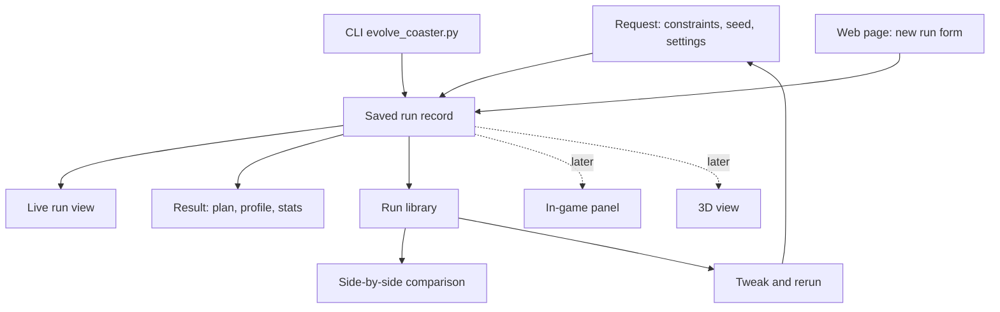
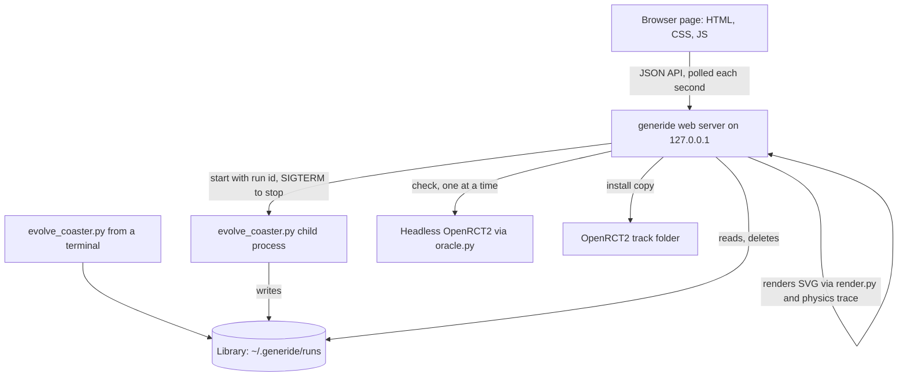
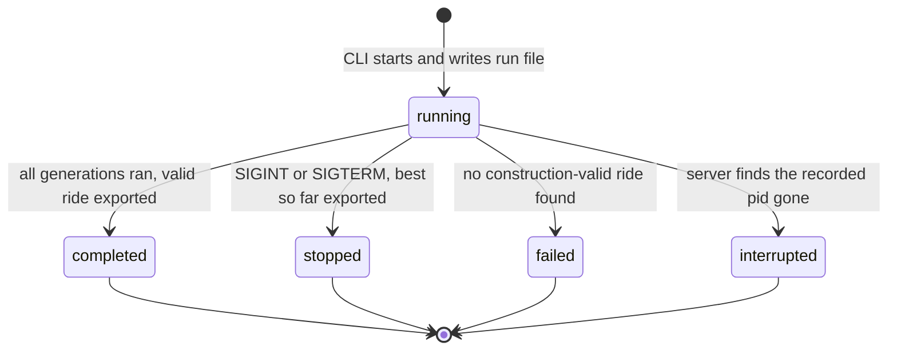

# generide Web UI - Plan

## Goal Capsule

- **Objective:** The RCT2 player stops installing Mine Train rides that turn out to be duds or ugly, and finds it easy to change a request, rerun it, and learn what the change did, without reading CLI help or opening the game to find out.
- **Means:** A local web page over a new saved-run record that the CLI and the page share, with live progress, a plan-plus-profile-plus-stats preview, a headless-game check, one-click install, a run library, and side-by-side comparison (approach C from the brainstorm).
- **Product authority:** This Product Contract is authoritative on behavior and scope. The in-game panel, 3D view, and concurrent runs are later areas, not active scope.
- **Authority hierarchy:** The Product Contract is authoritative on behavior and scope, and the Planning Contract's KTDs on how it is built. The implementer resolves execution-time specifics neither names.
- **Stop conditions:** Stop and flag if exposing the per-piece trace changes any number `physics.simulate` returns for an existing ride, or if writing run records changes the `.td6` the CLI exports for a given seed.
- **Execution profile:** Code change in one repo. Standard library only; no new dependencies. CI runs Python 3.9.
- **Tail ownership:** Standard `ce-work` handoff: commit and PR per repo convention, then drive CI to green.
- **Product Contract preservation:** changed: added R26 (delete runs) and R27 (record detail for future learning and replay), Key Decisions for macOS-only, the separate library folder, and record detail, AE9, and three deferred items, all from the planning conversation; the brainstorm's Outstanding Questions are resolved by KTD1 to KTD13 and removed.
- **Open blockers:** None.

---

## Product Contract

### Summary

A browser page served from the player's own machine becomes the main way to use generide. It sets up a Mine Train request with every setting visible and explained, shows the run live, and presents the result as a plan, a side profile, and ride stats. From there the player can check the ride in the headless game and install it under a chosen name. Every run is saved to a library, where the player can reopen a run, change an input, rerun it, and compare runs side by side.

### Problem Frame

Today the only way in is `evolve_coaster.py`, which has about 20 flags. The player did not know which ones existed, so did not know what could or could not be set.

Once a run starts, the terminal gives no sense of how long it will take, whether it is still working, or what the ride looks like as it improves. A 60-generation test run on 2026-09-27 found its best ride by generation 5 and spent the remaining 55 generations changing nothing, and nothing on screen said so.

Judging the result means copying the `.td6` into OpenRCT2's track folder, restarting the game if it is open, finding the design, building it, and riding it. The top-down plan that `--render` writes shows the footprint but not the drops, speed, or lift hill, so it does not answer whether a ride is worth that effort. The player has installed rides that turned out to be duds, or just ugly.

Nothing records which inputs produced which ride, so learning from a change means remembering numbers across terminal sessions.

### Key Decisions

- **Web page first, in-game panel later.** A local page is quicker to build and better at previews and charts. (session-settled: user-directed, chosen over an OpenRCT2 plugin window, a terminal UI, or web only: build the web page now and keep the in-game panel as a later option.) Governs R1.
- **Plan, side profile, and stats now; rotatable 3D later.** (session-settled: user-directed, chosen over a 3D view first, plan-only, or plan-plus-profile: start with plan + profile + numbers and keep a path to 3D.) Governs R10, R13, R14.
- **Check in the headless game, then install, with naming.** (session-settled: user-directed, chosen over install-only, download-only, or an automatic check: check then install, with a typed name or a naming template such as name plus date-time.) Governs R16, R17, R18, R19, R20.
- **A library with tweak-and-rerun.** (session-settled: user-directed, chosen over a library without rerun or current-run-only.) Governs R21, R22, R23.
- **Comparison is part of the first version (approach C).** A saved run record is the foundation, and side-by-side comparison is how the player learns from a change. (session-settled: user-approved, chosen over B, a plain run library, and A, a page wrapped around the CLI's console output: C serves "learn from tweaking" directly, and A cannot give a live preview without parsing console text.) Governs R24, R25.
- **One run at a time in the first version.** Several concurrent runs stay a roadmap option. (session-settled: user-directed, chosen over a queue or a parallel batch: allow multiple runs as a later enhancement.) Governs R8.
- **The run record is the shared source of truth.** The CLI and the page both write and read the same saved runs, so the later in-game panel and 3D view build on it rather than on new plumbing. Governs R3.
- **A rerun keeps the source run's seed unless the player changes it.** Without this, a comparison mixes the player's change with random luck. Governs R22.
- **Estimates and game-checked numbers are always labeled apart.** Our rating model is not calibrated, and the headless game's own numbers still carry an unexplained gap, so unlabeled numbers would teach the wrong lesson. Governs R7, R14, R16.
- **macOS only for now.** (session-settled: user-directed, chosen over supporting other operating systems now: the player plays on macOS only today, and other systems matter only if others start using generide.) Governs R1, R16, R17.
- **The library is generide's own folder, separate from the game.** Clearing it, or deleting runs from it, never touches rides installed in OpenRCT2. (session-settled: user-approved, chosen over treating installed designs as the store: the player wanted storage they can clear without affecting the game.) Governs R3, R26.
- **Run records keep full detail so later work can learn from them.** Every improvement of the best ride is kept with its complete track, so a future replay of how a ride evolved, or learning from past runs, needs no new data collection. Governs R3, R27.



### Requirements

**Serving and setup**

- R1. The UI is a web page served locally by generide and opened in the player's browser, on the same machine that runs OpenRCT2.
- R2. Starting the UI is a single command documented in the README, and the page works without OpenRCT2 installed, with only the check and install actions unavailable.
- R3. Every run, whether started from the page or the CLI, produces a saved run record holding its request, seed, progress snapshots, final track, stats, check result, and install history.

**Making a request**

- R4. The request form shows every setting the page supports, each with a plain-language explanation, its default, and its allowed range.
- R5. The settings that shape the ride are shown up front: footprint width and depth, target excitement, intensity, and nausea windows, station length, run length (generations and population), and seed. Everything else (mutation rate, genome type, fitness mode, seed track, oracle calibration) sits in an advanced section.
- R6. The form rejects out-of-range or contradictory values before a run starts and says which field is wrong and why.
- R7. The form tells the player that rating targets aim at our estimates, not the game's real ratings.

**Watching a run**

- R8. Only one run can be active at a time; starting another while one runs is refused with a pointer to the active run.
- R9. While a run is active the page shows the current generation, elapsed time, an estimated time remaining, and a visible sign that the run is still alive.
- R10. The page shows the best ride so far (plan, profile, and key stats) and a best-score-by-generation chart, both updating as the run progresses.
- R11. When the best score has not improved for a long stretch of generations, the page says so, so the player can decide to stop early.
- R12. The player can stop a run at any point and keep its best ride so far as the result.

**Judging a result**

- R13. The result view shows the top-down plan, a side profile of height along the ride with speed, drops, and the lift hill marked, and the ride stats.
- R14. Ride stats cover max speed, drop count and heights, airtime, g-forces, estimated excitement, intensity, and nausea, whether the train completes the circuit, and footprint used against footprint allowed, with every estimated number labeled as an estimate.
- R15. The result view makes it obvious when a ride failed construction validation or the train does not complete the circuit, and does not offer install for such a ride without a warning.

**Checking and installing**

- R16. A "check in real game" action builds the ride in headless OpenRCT2 and shows the game's excitement, intensity, and nausea next to our estimates, labeled as game-checked, with any failure (stall, build rejection, timeout) reported in plain language.
- R17. An install action copies the ride into the player's OpenRCT2 track folder so it appears under Mine Train in the Track Designs list.
- R18. Before installing, the player names the ride, either by typing a name or by using a saved naming template such as a base name plus date-time; the name becomes the design's file name.
- R19. The page states that OpenRCT2 must be restarted to see a newly installed design if the game is already open.
- R20. Every result can also be downloaded as a `.td6` without installing.

**Library, rerun, and comparison**

- R21. The library lists every saved run with its name, date, key inputs, headline stats, check result, and install status, newest first.
- R22. Opening a run from the library shows its full result view, and a rerun action opens the request form pre-filled with that run's inputs, including its seed.
- R23. A rerun remembers which run it came from.
- R24. The player can select two or three runs and see them side by side: inputs with the differences highlighted, plans and profiles next to each other, and stats with the changes marked.
- R25. Opening a rerun's result offers a one-click comparison with the run it came from.
- R26. The player can delete a run from the library; deleting never removes a design already installed in OpenRCT2, and an active run cannot be deleted.
- R27. A run record stores its request, every improvement of the best ride with the full track and the generation it appeared in, the final outcome, check results, and installs, in a versioned format that later tools can read.

### Key Flows

- F1. Set up and start a run
  - **Trigger:** The player opens the page and chooses a new run.
  - **Steps:** Reads the up-front settings and their explanations, optionally opens the advanced section, fixes any rejected values, starts the run.
  - **Outcome:** The page switches to the live view for that run.
  - **Covers:** R4, R5, R6, R7, R8
- F2. Watch a run
  - **Trigger:** A run is active.
  - **Steps:** Sees generation, elapsed and remaining time, and the best ride updating; may see a no-improvement notice; may stop early.
  - **Outcome:** The run finishes or is stopped, and the page shows its result.
  - **Covers:** R9, R10, R11, R12
- F3. Judge, check, and install
  - **Trigger:** A run has a result.
  - **Steps:** Looks at plan, profile, and stats; runs the headless-game check; names the ride; installs it or downloads it.
  - **Outcome:** The ride is in the track folder under the chosen name, or the player has decided it is not worth installing.
  - **Covers:** R13 to R20
- F4. Tweak, rerun, and compare
  - **Trigger:** The player wants to change something about a past ride.
  - **Steps:** Opens the run from the library, chooses rerun, changes one or more inputs (seed kept by default), starts it, and when it finishes opens the comparison with the source run.
  - **Outcome:** The player sees which inputs changed and how the ride and stats moved.
  - **Covers:** R21 to R26

### Acceptance Examples

- AE1. Covers R2, R16, R17. **Given** OpenRCT2 is not installed at the expected location, **when** the player opens a result, **then** check and install show as unavailable with the reason, and download still works.
- AE2. Covers R8. **Given** a run is active, **when** the player tries to start another, **then** the page refuses and links to the active run.
- AE3. Covers R12. **Given** a run is at generation 20 of 100, **when** the player stops it, **then** the result view shows the best ride found by generation 20 and the run is saved as stopped early.
- AE4. Covers R11. **Given** the best score has not changed for a long stretch of generations, **when** the player looks at the live view, **then** a notice says the run has stopped improving.
- AE5. Covers R18. **Given** a design with the chosen name already exists in the track folder, **when** the player installs, **then** the page asks whether to replace it or pick another name, and never overwrites silently.
- AE6. Covers R22, R23. **Given** the player reruns a past run and changes only the intensity window, **when** the form opens, **then** every other input, including the seed, matches the source run.
- AE7. Covers R15. **Given** a ride whose train does not complete the circuit, **when** the result is shown, **then** the failure is prominent and installing asks for confirmation first.
- AE8. Covers R3. **Given** the player runs `evolve_coaster.py` from the terminal, **when** they open the page, **then** that run appears in the library like any other.
- AE9. Covers R26. **Given** a run whose ride was installed, **when** the player deletes the run, **then** the run disappears from the library and the installed design is still in the track folder.

### Success Criteria

- The player stops installing rides that turn out to be duds or ugly: the preview and headless check are enough to reject them before opening the game.
- Tweaking inputs and learning from the result is noticeably easier: the player can tell from a comparison what a single input change did to the ride.
- The player can start a run with a constraint they have not used before without reading `--help`.

### Scope Boundaries

**Deferred for later**

- An in-game OpenRCT2 panel that talks to generide, including placing a design directly into an open park.
- A rotatable 3D view of the track.
- Several runs at once, as an opt-in option.
- A cost constraint on the request (named in the roadmap vision, not built in generide yet).
- Windows and Linux support for the headless check and install, if other players start using generide.
- A replay of how a ride evolved across a run, from the improvements the run record already keeps (R27).
- Using the library as a data source, for example training or tuning to reach good rides faster.

**Outside this work**

- Ride types other than Mine Train, per the strategy's boundary.
- Hosting the page anywhere other than the player's own machine, accounts, or sharing.
- Changing how evolution, fitness, or the oracle work, beyond exposing the progress and per-piece data this UI needs.

### Dependencies / Assumptions

- The player runs generide and OpenRCT2 on the same macOS machine. `rct2/oracle.py` hardcodes the OpenRCT2 binary at a macOS app path, and the README lists the per-platform track folder.
- `rct2/physics.py` computes speed piece by piece internally but returns only totals in `RideStats`. The side profile needs that per-piece trace exposed.
- The progress hook on `evolve_parts()` in `rct2/evolution.py` (`progress_callback(generation, population)`) is the starting point for live snapshots.
- `rct2/render.py` already draws the top-down plan and the fitness curve.
- The headless check costs about 4 seconds per track (`docs/headless-oracle-spike.md`), so it stays a player-triggered action.

### Sources / Research

- `evolve_coaster.py` for the current flag set and defaults.
- `rct2/evolution.py` (`evolve_parts`, `progress_callback`, `EvolutionStats`).
- `rct2/physics.py` (`simulate`, `RideStats`).
- `rct2/render.py` (`render_track`, `render_fitness_history`).
- `rct2/oracle.py` (`score_track`, `OPENRCT2_BINARY`).
- `README.md` for the track folder paths and the restart requirement.
- `STRATEGY.md` "Rendering and fit" track and the Mine-Train-only boundary.
- `docs/roadmap.md` for the request shape (footprint and rating windows) and the later ideas this plan defers.

---

## Planning Contract

### Key Technical Decisions

- KTD1. **Runs execute as a child `evolve_coaster.py` process, never inside the web server.** The server starts the CLI with the run's settings and a run id, then reads the run record the CLI writes. Terminal runs and page runs take the same code path, which is what makes R3 and AE8 hold. Stop becomes a signal to that process (KTD6), a crash in evolution cannot take the server down, and the server stays responsive while a run pins a CPU core. Rejected: running `evolve_parts()` in a server thread, which needs its own copy of the CLI's wiring and blocks on the GIL during scoring.
- KTD2. **Standard library only.** The server is `http.server.ThreadingHTTPServer` with a small JSON API; the page is one HTML file, one stylesheet, and one plain JavaScript file with no build step; live updates poll every second. `requirements.txt` stays `pytest` only and everything runs on CI's Python 3.9. Rejected: a web framework (new dependency for a single-user local tool) and server-sent events (a streaming connection the stdlib server handles poorly, for no visible gain at one-second updates).
- KTD3. **Pictures are server-rendered SVG, reusing `rct2/render.py`.** The plan, the new side profile, and the fitness curve come from Python and the page inlines them. They share one palette and dark mode, and the drawing stays testable in pytest. Rejected: a JavaScript charting library (dependency and a second rendering path to keep consistent).
- KTD4. **The library is a folder of run directories.** Default root `~/.generide/runs/`, overridable with the `GENERIDE_HOME` environment variable (root becomes `$GENERIDE_HOME/runs/`). Each run gets a sortable id (UTC date-time plus seed) and a directory holding: a run file (schema version, request, CLI settings, status, pid, timings, parent run id, final result, check results, installs), a progress log with one line per generation, an improvements log with the full track each time the best ride improves (R27), and the exported `best.td6`. Append-only logs mean a crash loses nothing already written, following `rct2/calibration_log.py`. Rejected: SQLite (harder to inspect and clear by hand, against the "folder I can wipe" decision) and a single JSON file per run (rewritten every generation).
- KTD5. **The CLI writes a run record by default.** New flags: `--run-id` (used by the server so it knows the directory before the process starts), `--parent-run` (rerun lineage, R23), and `--no-record` (opt out). The CLI prints the record's location. `--output` behaves exactly as today, and the record's `best.td6` is an extra copy.
- KTD6. **Stopping is cooperative.** `evolve()` and `evolve_parts()` gain an optional stop check consulted once per generation; when it fires they return the best so far, and `EvolutionStats.generations` reports the generations actually run. The CLI turns SIGINT and SIGTERM into that check, so Ctrl-C in a terminal and Stop on the page both produce a finished record with status `stopped` and an exported ride (R12, AE3).
- KTD7. **One settings table drives the form and its validation.** A new module lists every page-exposed setting with its CLI flag, type, default, range, up-front or advanced group, and help text (R4, R5). One validator returns errors keyed by field (R6). A test pins every entry to the CLI's argparse flag and default so the two cannot drift. The CLI keeps its own argparse definitions. Rejected: generating argparse from the table, which rewrites a tested CLI for no user-visible gain.
- KTD8. **The page defaults to physics scoring; the CLI keeps its proxy default.** Rating windows only work with physics scoring, and the README names it as the setting that produces real drops. Governs how the form pre-fills R5.
- KTD9. **The side profile comes from a per-piece trace in `rct2/physics.py`.** The energy walk records one point per piece (distance along the ride, height, speed in and out, on lift, in drop, stall) and `simulate()` is rebuilt on top of that same walk, so the profile and the stats can never disagree. A test compares `simulate()` before and after on every sample ride (stop condition in the Goal Capsule).
- KTD10. **Time remaining uses a rolling window; stagnation uses a fixed rule.** Remaining time is the mean duration of the last 10 generations times generations left, shown as "estimating" for the first 3. A whole-run average would underestimate once genomes grow, per `docs/solutions/performance-issues/genome-bloat-from-uncapped-fitness-rewards.md`. The no-improvement notice (R11) shows when the best score has not changed for at least 20 generations and at least a quarter of the planned run. Both are pure functions of the progress log, so they are unit-tested and easy to tune.
- KTD11. **OpenRCT2 access is one small module with overridable paths.** The game binary defaults to `rct2.oracle.OPENRCT2_BINARY` and the track folder to `~/Library/Application Support/OpenRCT2/track/`, overridable with `GENERIDE_OPENRCT2_BINARY` and `GENERIDE_TRACK_DIR` (per the macOS-only Key Decision). Check and install are available only when those paths exist (AE1). Checks run one at a time behind a lock, and a check is refused while the active run uses oracle calibration, because both install the same plugin file into OpenRCT2's plugin folder (`rct2/oracle.py` docstring: "Only one call should run at a time").
- KTD12. **Install names are sanitized and never overwrite silently.** A name has path separators and control characters removed, is trimmed, and capped at 60 characters, and becomes `<name>.td6`. Templates use `{name}`, `{date}`, `{time}`, and `{seed}` and are saved in `~/.generide/settings.json`. An existing file returns a conflict the page resolves by asking to replace or rename (AE5). Every install is appended to the run record.
- KTD13. **The server listens on 127.0.0.1 only and never takes a file path for run data from the browser.** Run ids are checked against the id pattern before any file access, which rules out path traversal through the API. The one path the form accepts, a seed track, must be an existing `.td6` file. No authentication: it is a single-user tool on the player's own machine.

### High-Level Technical Design

Components and data flow:



Run status lifecycle, as recorded in the run file:



`interrupted` is assigned when the recorded process no longer exists but the run file still says `running`, for example after a crash or a closed laptop. The server applies it when it lists or opens runs.

### Output Structure

```text
generide_web.py              entry point: python generide_web.py [--port N] [--no-browser]
rct2/
  runrecord.py               run record format, library read/write/list/delete, ETA and stagnation
  settings.py                page-exposed settings table and validation
  openrct2_paths.py          game and track folder locations, availability, install naming
  webui.py                   request handlers, run supervisor, check lock, SVG endpoints
  webui_static/
    index.html
    app.js
    style.css
tests/
  conftest.py                points GENERIDE_HOME at a temp folder for every test
  test_runrecord.py
  test_settings.py
  test_openrct2_paths.py
  test_webui.py
```

### Assumptions

- The player's Mac has OpenRCT2 at the path `rct2/oracle.py` already expects, or the player sets `GENERIDE_OPENRCT2_BINARY`.
- One player on one machine: no concurrent writers besides a terminal run and the page, which KTD4's per-run directories keep apart.

### Deferred to Implementation

- Exact tuning of the stagnation rule and ETA window once real runs are watched (KTD10 keeps them in one place).
- Whether the live view re-renders the plan and profile on every poll or only when the improvements log grows; decide from how heavy rendering feels in practice.
- Layout details of each screen beyond the regions named in U8.

### System-Wide Impact

- **CLI behavior:** every run now writes a small directory under the player's home folder and prints one extra line. Existing flags and the exported `.td6` are unchanged. `tests/conftest.py` must redirect `GENERIDE_HOME` so the test suite never writes to a real home folder, including in CI.
- **Evolution API:** `evolve()` and `evolve_parts()` gain an optional parameter; existing callers (`rct2/benchmark.py`, tests) are unaffected.
- **Physics:** `simulate()` is restructured around the new trace but must return identical numbers (Goal Capsule stop condition).
- **OpenRCT2 folders:** install writes into the player's real track folder; check writes and removes a plugin file in the real plugin folder, as the oracle already does.

### Risks & Dependencies

| Risk | Mitigation |
|---|---|
| A page check and a calibrating run both write the oracle plugin file | KTD11 lock plus refusal while a calibrating run is active |
| Server closes while a run continues | The child keeps writing its record; on restart the server finds the live pid and shows the run as running, or marks it interrupted if the pid is gone |
| Rebuilding `simulate()` on the trace shifts a number | Equality test over every sample ride before the refactor lands (U2) |
| Tests write into the developer's real home folder | Autouse fixture in `tests/conftest.py` (U3) |
| Browser code has no automated tests | Keep logic in Python (validation, diffs, ETA, SVG) and keep the JavaScript to fetching and placing results; manual Chromium check in the Verification Contract |

---

## Implementation Units

### U1. Cooperative stop in the evolution loops

- **Goal:** A running evolution can be asked to stop at the next generation boundary and still returns its best ride.
- **Requirements:** R12, AE3; KTD6.
- **Dependencies:** None.
- **Files:** `rct2/evolution.py`, `tests/test_evolution.py`.
- **Approach:**
  1. Add an optional stop-check callable to `evolve()` and `evolve_parts()`, consulted at the top of each generation after the progress callback.
  2. When it returns true, leave the loop and build `EvolutionStats` from the current population, with `generations` set to the number actually run.
  3. When it is absent, behavior is byte-for-byte unchanged.
- **Patterns to follow:** the existing `progress_callback` parameter and docstring style in `evolve_parts()`.
- **Test scenarios:**
  - A stop check that fires at generation 5 of 50 returns stats with `generations == 5` and a best individual taken from the population at that point.
  - A stop check that never fires gives results identical to a run without one, for the same seed.
  - A stop check that fires before the first generation returns the seed-derived best rather than raising.
  - Both `evolve()` and `evolve_parts()` honor the check.
- **Verification:** existing evolution tests pass unchanged, and the new scenarios pass.

### U2. Per-piece physics trace and side-profile SVG

- **Goal:** generide can describe a ride piece by piece and draw it as a side profile.
- **Requirements:** R10, R13; KTD3, KTD9.
- **Dependencies:** None.
- **Files:** `rct2/physics.py`, `rct2/render.py`, `tests/test_physics.py`, `tests/test_render.py`.
- **Approach:**
  1. First add a test that records `simulate()` output for every ride in `data/sample_rides/` and a few generated tracks, so the refactor has a fixed reference.
  2. Extract the energy walk into a trace function returning one point per piece: cumulative distance, height at entry and exit, speed in and out, whether the piece is on the lift or station, whether it is part of a counted drop, and the stall index if the train stops.
  3. Rebuild `simulate()` to aggregate from the trace.
  4. Add a profile renderer: height against distance as a line, speed as a second series, lift section and drops marked, the stall point marked when present. Reuse the palette, dark-mode stylesheet, and escaping helpers already in `rct2/render.py`.
- **Execution note:** write the equality test against the current `simulate()` before touching it.
- **Patterns to follow:** `render_track()` and `render_fitness_history()` in `rct2/render.py`; the existing `_empty_svg` fallback.
- **Test scenarios:**
  - `simulate()` returns identical `RideStats` before and after the refactor for every sample ride.
  - The trace has one point per piece for a completed ride, and its final distance equals `RideStats.ride_length`.
  - For a ride that stalls, the trace ends at the stall piece and reports the same `stall_index` as `simulate()`.
  - Drop markings in the trace agree with `drop_count` from `simulate()`.
  - The profile SVG for a sample ride is well-formed XML, contains a title, and marks the lift section.
  - The profile SVG for an empty track uses the empty-state fallback.
- **Verification:** new and existing physics and render tests pass; a profile for the Manic Miner sample looks right when opened in a browser.

### U3. Run record and library

- **Goal:** Runs are saved in a readable, versioned folder format that can be listed, read, summarized, and deleted.
- **Requirements:** R3, R21, R23, R26, R27, AE8, AE9; KTD4, KTD10, KTD13.
- **Dependencies:** None.
- **Files:** `rct2/runrecord.py`, `tests/conftest.py`, `tests/test_runrecord.py`.
- **Approach:**
  1. Define the run file contents (schema version, id, created time, request and settings, parent id, status, pid, timings, final result summary, check results, installs) and the two append-only logs (progress per generation, improvements with full tracks).
  2. Provide: create a run directory, append progress, append an improvement, finish with a status, record a check, record an install, list runs newest first, load one run, and delete one run.
  3. Status repair: a run marked running whose pid no longer exists is reported and saved as interrupted.
  4. Pure helpers over the progress log: time remaining (rolling window) and stagnation (per KTD10).
  5. Validate run ids against the id pattern before any path is built, and add a numeric suffix when two runs would get the same id.
  6. A run's display name is its most recent install name, or its date and seed when it has never been installed (R21).
  7. Add `tests/conftest.py` with an autouse fixture pointing `GENERIDE_HOME` at a temp folder.
- **Patterns to follow:** `rct2/calibration_log.py` for append-only JSON lines and crash safety; `rct2/benchmark.py` `RunResult` for keeping full segment lists.
- **Test scenarios:**
  - Creating a run, appending progress and improvements, and finishing it round-trips through load with every field intact.
  - Listing returns runs newest first and includes runs created by separate calls, as a terminal run would be.
  - A run with a truncated last log line (simulated crash) still loads, dropping only the partial line.
  - A running run whose pid does not exist is reported as interrupted; one whose pid is alive stays running.
  - Covers AE9. Deleting a run removes its directory and leaves an unrelated file in a fake track folder untouched.
  - Deleting a running run is refused.
  - Ids containing `..`, `/`, or other characters outside the pattern are rejected before touching the file system.
  - Time remaining returns "estimating" before 3 generations, and uses only the last 10 durations when early generations were much faster.
  - Stagnation fires at 20 unchanged generations in a 60-generation run, not at 20 in a 200-generation run (quarter rule), and never while the best keeps improving.
  - Records carry the schema version, and loading a record with an unknown future version fails with a clear error.
- **Verification:** tests pass without touching the real home folder.

### U4. CLI writes run records and handles stop

- **Goal:** Every `evolve_coaster.py` run leaves a complete run record, and Ctrl-C or SIGTERM ends it cleanly.
- **Requirements:** R3, R12, R23, R27, AE3, AE8; KTD5, KTD6.
- **Dependencies:** U1, U3.
- **Files:** `evolve_coaster.py`, `tests/test_evolve_coaster.py`.
- **Approach:**
  1. Add `--run-id`, `--parent-run`, and `--no-record`.
  2. Unless `--no-record`, create the run at start with the full request and settings, append progress from the progress callback on every generation (always, not only with `--verbose`), and append an improvement whenever the best fitness rises.
  3. Install SIGINT and SIGTERM handlers that set a flag the evolution stop check reads.
  4. At the end, compute ride stats, estimated ratings, and footprint used (from `render.plan_track`) for the best ride, export `best.td6` into the run directory, and finish with status completed, stopped, or failed.
  5. Keep console output as today, plus one line naming the record location.
- **Patterns to follow:** existing `_fake_run` monkeypatching in `tests/test_evolve_coaster.py`.
- **Test scenarios:**
  - Covers AE8. A CLI run writes a run directory with progress for each generation, at least one improvement, a `best.td6`, and status completed.
  - `--output` still writes the same `.td6` bytes as before for a fixed seed.
  - `--no-record` writes nothing under `GENERIDE_HOME`.
  - `--parent-run` is stored as the run's parent.
  - Covers AE3. A stop requested mid-run yields status stopped, the generations actually run, and an exported best ride.
  - A run with no construction-valid ride finishes as failed, keeps its improvements, and exports nothing, while still exiting with code 1.
- **Verification:** CLI tests pass; a real short run from the terminal shows up with `generide_web.py` in U8.

### U5. Settings table and validation

- **Goal:** One definition of every page-exposed setting feeds the form, its help text, and its validation.
- **Requirements:** R4, R5, R6, R7, R22, AE6; KTD7, KTD8.
- **Dependencies:** None.
- **Files:** `rct2/settings.py`, `tests/test_settings.py`.
- **Approach:**
  1. Table entries for the up-front group (footprint width and depth, excitement, intensity, and nausea windows, station length, generations, population, seed) and the advanced group (fitness mode, genome, mutation rate, seed track, oracle calibration and its interval and cap).
  2. Each entry carries CLI flag, type, default, range, group, plain-language help, and for rating windows the note that targets aim at estimates (R7). The page default for fitness is physics (KTD8).
  3. A validator takes form values and returns either CLI arguments or errors keyed by field.
  4. Cross-field rules: window minimum above maximum; rating windows with proxy fitness; oracle calibration with the pieces genome (mirrors the CLI's existing check); a seed track path that is not an existing `.td6`.
  5. A helper turns a stored run request back into form values, seed included, for rerun (R22).
- **Test scenarios:**
  - Every table entry's CLI flag exists in `evolve_coaster.py`'s parser with the same default, except the documented fitness default difference.
  - Valid values produce CLI arguments that `evolve_coaster.py`'s parser accepts.
  - Excitement window 7 to 5 returns an error on that field naming the order problem.
  - An intensity window with proxy fitness returns an error explaining that windows need physics scoring.
  - A generations value of 0 or a station length below the minimum returns a range error.
  - Covers AE6. A stored request converted to form values and back produces the same CLI arguments, seed included.
- **Verification:** tests pass; each help text reads as a plain sentence.

### U6. OpenRCT2 locations, check, and install

- **Goal:** The page can tell whether the game is available, check a ride in it one at a time, and install a ride under a safe name without overwriting silently.
- **Requirements:** R2, R16, R17, R18, R19, R20, AE1, AE5; KTD11, KTD12.
- **Dependencies:** U3.
- **Files:** `rct2/openrct2_paths.py`, `tests/test_openrct2_paths.py`.
- **Approach:**
  1. Resolve the binary and track folder from environment overrides or macOS defaults, and report availability with a reason when missing.
  2. Name handling: sanitize, apply a template, and detect a clash in the track folder.
  3. Install copies the run's `best.td6` to the track folder under the final name, with an explicit replace flag required when the file exists, and records the install in the run.
  4. Check wraps `rct2.oracle.score_track` behind a process-wide lock, records the result (status, game ratings, stall location, detail) in the run, and maps each oracle status to a plain-language message.
  5. Naming templates are read from and saved to `~/.generide/settings.json`.
- **Patterns to follow:** the injectable scorer in `evolve_parts()` (`oracle_scorer`), so tests never need OpenRCT2.
- **Test scenarios:**
  - Covers AE1. With the binary path pointing at a missing file, availability reports check and install unavailable with a reason.
  - Template `{name} {date}` with name "Canyon" and a fixed clock gives `Canyon 2026-09-27.td6`.
  - Names containing `/`, `..`, newlines, or 200 characters come out filesystem-safe and at most 60 characters.
  - Covers AE5. Installing onto an existing name without the replace flag reports a conflict and leaves the existing file unchanged; with the flag it replaces it.
  - A successful install puts a byte-identical `.td6` in the track folder and appends the install to the run.
  - A check with a fake scorer returning `stalled` at piece 42 records the status and yields a message naming the piece.
  - Two checks started together run one after the other, never overlapping in the fake scorer.
- **Verification:** tests pass with no OpenRCT2 present, as in CI.

### U7. Web server and JSON API

- **Goal:** A local server that serves the page, starts and stops runs, and answers everything the page shows.
- **Requirements:** R1, R2, R8, R9, R10, R11, R12, R13, R14, R15, R16, R17, R20, R21, R22, R24, R25, R26, AE2; KTD1, KTD2, KTD3, KTD10, KTD11, KTD13.
- **Dependencies:** U2, U3, U4, U5, U6.
- **Files:** `rct2/webui.py`, `generide_web.py`, `tests/test_webui.py`.
- **Approach:**
  1. Keep request handling as plain functions from request data to response data, with a thin `http.server` adapter, so most tests call handlers directly.
  2. Run supervisor: start `evolve_coaster.py` as a child with validated arguments and a new run id, refuse a second start while one is active (AE2), send SIGTERM on stop, and reap the child.
  3. Endpoints for: settings table and defaults, validate, start, stop, active run status (generation, elapsed, remaining, stagnation, latest best stats), list runs, get run, rerun form values, compare two or three runs (input differences and stat deltas), availability, check, install (with conflict reply), download `.td6`, delete, and SVG for a run's plan, profile, and fitness curve.
  4. Result summaries flag construction failures and incomplete circuits so the page can warn (R15), and label every rating as estimated or game-checked.
  5. Checks run in a background thread so the request returns immediately; the page polls the run for the result. A check is refused while an active run uses oracle calibration (KTD11).
  6. `generide_web.py` binds 127.0.0.1 on a default port, prints the URL, and opens the browser unless `--no-browser`.
- **Patterns to follow:** root-level entry scripts such as `run_benchmark.py`.
- **Test scenarios:**
  - Starting a run with a fake child command creates a run and reports it active; a second start returns a refusal naming the active run (covers AE2).
  - Stopping sends the stop signal and the run ends as stopped.
  - Status for an active run reports generation, remaining-time estimate, and stagnation from its progress log.
  - Compare of two runs differing only in intensity window and seed reports exactly those inputs as different, plus stat deltas.
  - Compare refuses one run or four runs.
  - Invalid form values return field errors and start nothing.
  - Unknown or malformed run ids return not found without touching the file system.
  - Plan, profile, and fitness SVG endpoints return SVG for a completed run.
  - Download returns the run's `.td6` bytes.
  - Check is refused while a calibrating run is active.
  - Integration: a real `ThreadingHTTPServer` on port 0 serves the page and the settings endpoint over HTTP.
  - Integration: a real short CLI child run (few generations, small population) started through the API finishes as completed and appears in the run list.
- **Verification:** tests pass on Python 3.9.

### U8. The page

- **Goal:** The browser page covering new run, live view, result, library, and comparison.
- **Requirements:** R4 to R26; F1 to F4; AE1 to AE9.
- **Dependencies:** U7.
- **Files:** `rct2/webui_static/index.html`, `rct2/webui_static/app.js`, `rct2/webui_static/style.css`.
- **Approach:**
  1. New run: up-front settings with help text, a collapsed advanced section, field errors shown next to fields, and a start button disabled while a run is active.
  2. Live view: generation, elapsed, remaining, a pulsing alive indicator, best ride plan and profile, key stats, fitness curve, stagnation notice, and a stop button.
  3. Result: plan, profile, stats with estimate labels, failure banners, check button and results next to estimates, name field with template picker, install with the restart note (R19) and replace-or-rename prompt, and download.
  4. Library: newest-first list with key inputs, headline stats, check and install badges, open, rerun, compare selection, and delete with confirmation.
  5. Compare: two or three columns with changed inputs highlighted, plans and profiles side by side, stat deltas marked.
  6. Colors follow the palette in `rct2/render.py` so the inlined SVGs sit naturally in light and dark mode.
- **Execution note:** keep all decisions in the API; the JavaScript fetches, renders returned data, and polls. Prefer a smoke check in Chromium over unit tests here.
- **Test scenarios:** manual, in Chromium, because the repo has no JavaScript test setup and KTD2 rules out adding one. Logic behind each check is covered by U7's API tests.
  - Covers F1. Every up-front setting shows its help text and default; opening the advanced section reveals the rest.
  - Entering excitement 7 to 5 shows the error beside that field and the run does not start.
  - Covers F2. A running run updates generation, elapsed, and remaining about once a second, and the plan and profile change when the best ride improves.
  - Covers AE2. With a run active, the start button is disabled and links to the active run.
  - Covers AE3. Stop mid-run lands on a result showing the best ride so far, marked as stopped early.
  - Covers AE7. A ride that does not complete its circuit shows a failure banner, and install asks for confirmation.
  - Covers AE5. Installing onto an existing name offers replace or rename.
  - Covers AE6 and R25. Rerun pre-fills the source run's inputs and seed; its result offers a one-click comparison that highlights the changed input.
  - Covers AE9. Deleting a run asks for confirmation and removes it from the list.
  - Light and dark mode both render the page and the inlined SVGs legibly, and the page has no horizontal scroll at 390px wide.
- **Verification:** the Verification Contract's manual walkthrough passes in Chromium in both light and dark mode, including at phone width without horizontal scrolling.

### U9. Documentation

- **Goal:** A player can find and start the UI from the README, and the project docs reflect the new capability.
- **Requirements:** R2.
- **Dependencies:** U8.
- **Files:** `README.md`, `docs/devlog.md`, `docs/roadmap.md`, `CONCEPTS.md`.
- **Approach:**
  1. README: a "Use the web UI" section above the CLI instructions with the start command, what each screen does, where the library lives and that it can be cleared, the environment overrides, and the macOS-only note for check and install. Mention that CLI runs now save to the library and `--no-record` turns it off.
  2. Devlog entry for the build, including anything learned about ETA and stagnation tuning.
  3. Roadmap status rows for the web UI and the deferred items.
  4. `CONCEPTS.md`: refine "Run record" if its meaning shifted during the build.
- **Test scenarios:**
  - Test expectation: none -- documentation only.
- **Verification:** following the README from a fresh clone starts the UI.

---

## Verification Contract

| Gate | Command or check | Applies to |
|---|---|---|
| Unit and integration tests | `pytest` (CI runs it on Python 3.9 via `.github/workflows/tests.yml`) | U1 to U7 |
| Physics unchanged | U2's equality test over `data/sample_rides/` | U2 |
| No home-folder writes in tests | Run `pytest` with `HOME` pointed at an empty temp folder and confirm it stays empty | U3, U4 |
| Dependencies unchanged | `requirements.txt` still lists only `pytest` | All |
| Manual page walkthrough | Start `python generide_web.py --no-browser`, open it in Chromium, then: start a 30-generation run, watch it update, stop it, open the result, rerun with one changed input, compare the two, delete one. Repeat in dark mode and at 390px width. | U7, U8 |
| Real game check and install | On the player's Mac: check a finished ride, install it under a template name, restart OpenRCT2, and find it under Mine Train in Track Designs | U6, U8 |

## Definition of Done

- Every unit's verification holds and `pytest` is green in CI.
- The manual page walkthrough passes; the real game check and install is confirmed on the player's Mac or listed in the PR as the remaining manual step.
- `simulate()` returns identical numbers for every sample ride.
- The CLI exports the same `.td6` for a fixed seed as before this work.
- `requirements.txt` is unchanged.
- The README describes how to start and use the UI.
- No leftover experimental code, unused endpoints, or debug output from abandoned approaches remains in the diff.
