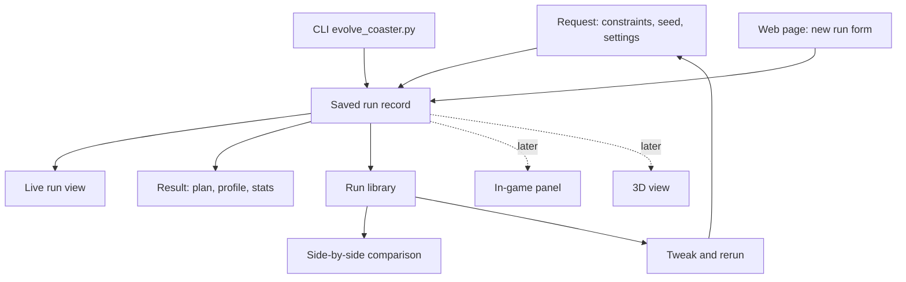

# generide Web UI - Plan

## Goal Capsule

- **Objective:** The RCT2 player stops installing Mine Train rides that turn out to be duds or ugly, and finds it easy to change a request, rerun it, and learn what the change did, without reading CLI help or opening the game to find out.
- **Means:** A local web page over a new saved-run record that the CLI and the page share, with live progress, a plan-plus-profile-plus-stats preview, a headless-game check, one-click install, a run library, and side-by-side comparison (approach C from the brainstorm).
- **Product authority:** This Product Contract is authoritative on behavior and scope. The in-game panel, 3D view, and concurrent runs are later areas, not active scope.
- **Open blockers:** None. Items under Outstanding Questions are deferred to planning.

---

## Product Contract

### Summary

A browser page served from the player's own machine becomes the main way to use generide. It sets up a Mine Train request with every setting visible and explained, shows the run live, and presents the result as a plan, a side profile, and ride stats. From there the player can check the ride in the headless game and install it under a chosen name. Every run is saved to a library, where the player can reopen a run, change an input, rerun it, and compare runs side by side.

### Problem Frame

Today the only way in is `evolve_coaster.py`, which has about 20 flags. The player did not know which ones existed, so did not know what could or could not be set.

Once a run starts, the terminal gives no sense of how long it will take, whether it is still working, or what the ride looks like as it improves. A 60-generation test run on 2026-09-27 found its best ride by generation 5 and spent the remaining 55 generations changing nothing, and nothing on screen said so.

Judging the result means copying the `.td6` into OpenRCT2's track folder, restarting the game if it is open, finding the design, building it, and riding it. The top-down plan that `--render` writes shows the footprint but not the drops, speed, or lift hill, so it does not answer whether a ride is worth that effort. The player has installed rides that turned out to be duds, or just ugly.

Nothing records which inputs produced which ride, so learning from a change means remembering numbers across terminal sessions.

### Key Decisions

- **Web page first, in-game panel later.** A local page is quicker to build and better at previews and charts. (session-settled: user-directed, chosen over an OpenRCT2 plugin window, a terminal UI, or web only: build the web page now and keep the in-game panel as a later option.) Governs R1.
- **Plan, side profile, and stats now; rotatable 3D later.** (session-settled: user-directed, chosen over a 3D view first, plan-only, or plan-plus-profile: start with plan + profile + numbers and keep a path to 3D.) Governs R10, R13, R14.
- **Check in the headless game, then install, with naming.** (session-settled: user-directed, chosen over install-only, download-only, or an automatic check: check then install, with a typed name or a naming template such as name plus date-time.) Governs R16, R17, R18, R19, R20.
- **A library with tweak-and-rerun.** (session-settled: user-directed, chosen over a library without rerun or current-run-only.) Governs R21, R22, R23.
- **Comparison is part of the first version (approach C).** A saved run record is the foundation, and side-by-side comparison is how the player learns from a change. (session-settled: user-approved, chosen over B, a plain run library, and A, a page wrapped around the CLI's console output: C serves "learn from tweaking" directly, and A cannot give a live preview without parsing console text.) Governs R24, R25.
- **One run at a time in the first version.** Several concurrent runs stay a roadmap option. (session-settled: user-directed, chosen over a queue or a parallel batch: allow multiple runs as a later enhancement.) Governs R8.
- **The run record is the shared source of truth.** The CLI and the page both write and read the same saved runs, so the later in-game panel and 3D view build on it rather than on new plumbing. Governs R3.
- **A rerun keeps the source run's seed unless the player changes it.** Without this, a comparison mixes the player's change with random luck. Governs R22.
- **Estimates and game-checked numbers are always labeled apart.** Our rating model is not calibrated, and the headless game's own numbers still carry an unexplained gap, so unlabeled numbers would teach the wrong lesson. Governs R7, R14, R16.

### Requirements

**Serving and setup**

- R1. The UI is a web page served locally by generide and opened in the player's browser, on the same machine that runs OpenRCT2.
- R2. Starting the UI is a single command documented in the README, and the page works without OpenRCT2 installed, with only the check and install actions unavailable.
- R3. Every run, whether started from the page or the CLI, produces a saved run record holding its request, seed, progress snapshots, final track, stats, check result, and install history.

**Making a request**

- R4. The request form shows every setting the page supports, each with a plain-language explanation, its default, and its allowed range.
- R5. The settings that shape the ride are shown up front: footprint width and depth, target excitement, intensity, and nausea windows, station length, run length (generations and population), and seed. Everything else (mutation rate, genome type, fitness mode, seed track, oracle calibration) sits in an advanced section.
- R6. The form rejects out-of-range or contradictory values before a run starts and says which field is wrong and why.
- R7. The form tells the player that rating targets aim at our estimates, not the game's real ratings.

**Watching a run**

- R8. Only one run can be active at a time; starting another while one runs is refused with a pointer to the active run.
- R9. While a run is active the page shows the current generation, elapsed time, an estimated time remaining, and a visible sign that the run is still alive.
- R10. The page shows the best ride so far (plan, profile, and key stats) and a best-score-by-generation chart, both updating as the run progresses.
- R11. When the best score has not improved for a long stretch of generations, the page says so, so the player can decide to stop early.
- R12. The player can stop a run at any point and keep its best ride so far as the result.

**Judging a result**

- R13. The result view shows the top-down plan, a side profile of height along the ride with speed, drops, and the lift hill marked, and the ride stats.
- R14. Ride stats cover max speed, drop count and heights, airtime, g-forces, estimated excitement, intensity, and nausea, whether the train completes the circuit, and footprint used against footprint allowed, with every estimated number labeled as an estimate.
- R15. The result view makes it obvious when a ride failed construction validation or the train does not complete the circuit, and does not offer install for such a ride without a warning.

**Checking and installing**

- R16. A "check in real game" action builds the ride in headless OpenRCT2 and shows the game's excitement, intensity, and nausea next to our estimates, labeled as game-checked, with any failure (stall, build rejection, timeout) reported in plain language.
- R17. An install action copies the ride into the player's OpenRCT2 track folder so it appears under Mine Train in the Track Designs list.
- R18. Before installing, the player names the ride, either by typing a name or by using a saved naming template such as a base name plus date-time; the name becomes the design's file name.
- R19. The page states that OpenRCT2 must be restarted to see a newly installed design if the game is already open.
- R20. Every result can also be downloaded as a `.td6` without installing.

**Library, rerun, and comparison**

- R21. The library lists every saved run with its name, date, key inputs, headline stats, check result, and install status, newest first.
- R22. Opening a run from the library shows its full result view, and a rerun action opens the request form pre-filled with that run's inputs, including its seed.
- R23. A rerun remembers which run it came from.
- R24. The player can select two or three runs and see them side by side: inputs with the differences highlighted, plans and profiles next to each other, and stats with the changes marked.
- R25. Opening a rerun's result offers a one-click comparison with the run it came from.

### Key Flows

- F1. Set up and start a run
  - **Trigger:** The player opens the page and chooses a new run.
  - **Steps:** Reads the up-front settings and their explanations, optionally opens the advanced section, fixes any rejected values, starts the run.
  - **Outcome:** The page switches to the live view for that run.
  - **Covers:** R4, R5, R6, R7, R8
- F2. Watch a run
  - **Trigger:** A run is active.
  - **Steps:** Sees generation, elapsed and remaining time, and the best ride updating; may see a no-improvement notice; may stop early.
  - **Outcome:** The run finishes or is stopped, and the page shows its result.
  - **Covers:** R9, R10, R11, R12
- F3. Judge, check, and install
  - **Trigger:** A run has a result.
  - **Steps:** Looks at plan, profile, and stats; runs the headless-game check; names the ride; installs it or downloads it.
  - **Outcome:** The ride is in the track folder under the chosen name, or the player has decided it is not worth installing.
  - **Covers:** R13 to R20
- F4. Tweak, rerun, and compare
  - **Trigger:** The player wants to change something about a past ride.
  - **Steps:** Opens the run from the library, chooses rerun, changes one or more inputs (seed kept by default), starts it, and when it finishes opens the comparison with the source run.
  - **Outcome:** The player sees which inputs changed and how the ride and stats moved.
  - **Covers:** R21 to R25

### Acceptance Examples

- AE1. Covers R2, R16, R17. **Given** OpenRCT2 is not installed at the expected location, **when** the player opens a result, **then** check and install show as unavailable with the reason, and download still works.
- AE2. Covers R8. **Given** a run is active, **when** the player tries to start another, **then** the page refuses and links to the active run.
- AE3. Covers R12. **Given** a run is at generation 20 of 100, **when** the player stops it, **then** the result view shows the best ride found by generation 20 and the run is saved as stopped early.
- AE4. Covers R11. **Given** the best score has not changed for a long stretch of generations, **when** the player looks at the live view, **then** a notice says the run has stopped improving.
- AE5. Covers R18. **Given** a design with the chosen name already exists in the track folder, **when** the player installs, **then** the page asks whether to replace it or pick another name, and never overwrites silently.
- AE6. Covers R22, R23. **Given** the player reruns a past run and changes only the intensity window, **when** the form opens, **then** every other input, including the seed, matches the source run.
- AE7. Covers R15. **Given** a ride whose train does not complete the circuit, **when** the result is shown, **then** the failure is prominent and installing asks for confirmation first.
- AE8. Covers R3. **Given** the player runs `evolve_coaster.py` from the terminal, **when** they open the page, **then** that run appears in the library like any other.

### Success Criteria

- The player stops installing rides that turn out to be duds or ugly: the preview and headless check are enough to reject them before opening the game.
- Tweaking inputs and learning from the result is noticeably easier: the player can tell from a comparison what a single input change did to the ride.
- The player can start a run with a constraint they have not used before without reading `--help`.

### Scope Boundaries

**Deferred for later**

- An in-game OpenRCT2 panel that talks to generide, including placing a design directly into an open park.
- A rotatable 3D view of the track.
- Several runs at once, as an opt-in option.
- A cost constraint on the request (named in the roadmap vision, not built in generide yet).

**Outside this work**

- Ride types other than Mine Train, per the strategy's boundary.
- Hosting the page anywhere other than the player's own machine, accounts, or sharing.
- Changing how evolution, fitness, or the oracle work, beyond exposing the progress and per-piece data this UI needs.

### Dependencies / Assumptions

- The player runs generide and OpenRCT2 on the same macOS machine. `rct2/oracle.py` hardcodes the OpenRCT2 binary at a macOS app path, and the README lists the per-platform track folder.
- `rct2/physics.py` computes speed piece by piece internally but returns only totals in `RideStats`. The side profile needs that per-piece trace exposed.
- The progress hook on `evolve_parts()` in `rct2/evolution.py` (`progress_callback(generation, population)`) is the starting point for live snapshots.
- `rct2/render.py` already draws the top-down plan and the fitness curve.
- The headless check costs about 4 seconds per track (`docs/headless-oracle-spike.md`), so it stays a player-triggered action.

### Outstanding Questions

**Deferred to Planning**

- How the page is served and what it depends on, given the project's current single dependency (`pytest`). Standard-library serving is one option.
- Where the run library lives on disk, and how existing loose `.td6` outputs relate to it.
- How often progress snapshots are taken, and what "a long stretch" means for the no-improvement notice.
- How the time estimate is computed, including runs that include oracle calibration.
- How the page finds the OpenRCT2 binary and track folder, given the hardcoded macOS path.
- How the CLI's existing output and flags stay compatible once it writes run records.

### Sources / Research

- `evolve_coaster.py` for the current flag set and defaults.
- `rct2/evolution.py` (`evolve_parts`, `progress_callback`, `EvolutionStats`).
- `rct2/physics.py` (`simulate`, `RideStats`).
- `rct2/render.py` (`render_track`, `render_fitness_history`).
- `rct2/oracle.py` (`score_track`, `OPENRCT2_BINARY`).
- `README.md` for the track folder paths and the restart requirement.
- `STRATEGY.md` "Rendering and fit" track and the Mine-Train-only boundary.
- `docs/roadmap.md` for the request shape (footprint and rating windows) and the later ideas this plan defers.
