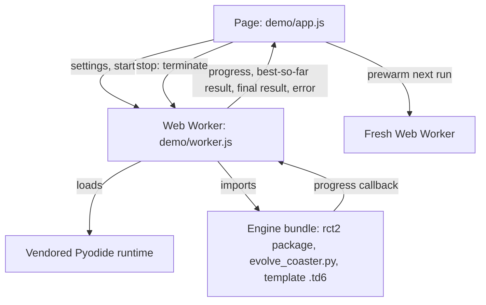
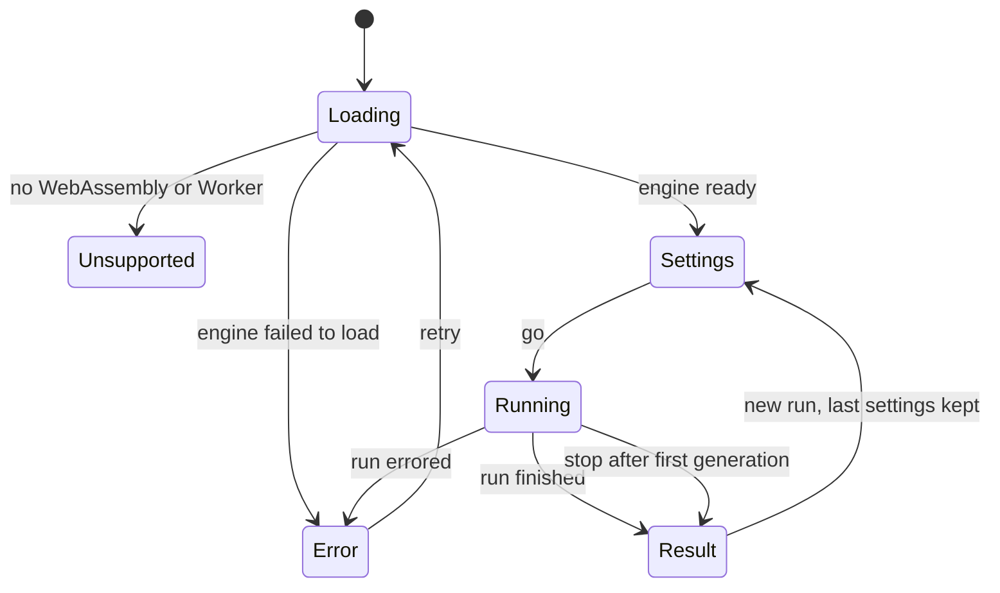

# Try generide in the Browser - Plan

## Goal Capsule

- **Objective:** A developer who finds generide through Josh's portfolio can pick ride settings, press go, and watch a Mine Train ride evolve, from a single link, without installing anything.
- **Means:** A public static page on GitHub Pages that runs generide's own Python engine in a Web Worker through a vendored Pyodide runtime (KTD1, KTD2).
- **Product authority:** This Product Contract is authoritative on behavior and scope. A smoother local install and a one-click cloud dev environment are related later areas, not active scope.
- **Authority hierarchy:** The Product Contract wins on behavior and scope; the Planning Contract's KTDs win on how it is built. The implementer resolves execution-time specifics neither names.
- **Stop conditions:** Stop and report if measurement shows no run size meets R16 within about 2 minutes in a desktop browser, or if any engine module the run imports cannot load in Pyodide without changing engine behavior for the CLI.
- **Execution profile:** Code change in one repo. The engine stays standard library only. Node and Playwright are added for building and testing the page only, under `demo/`. CI runs Python 3.9.
- **Who finishes:** The executor builds, tests, and opens the PR. Turning on GitHub Pages (Settings, Pages, Source: GitHub Actions) is a one-time step for Josh.
- **Open blockers:** None.

---

## Product Contract

### Summary

A public web page runs generide's evolution engine in the visitor's browser. The visitor chooses from a short set of ride settings sized so runs finish fast, presses go, and watches the plan, side profile, and best score improve live. The run ends with the finished ride, its stats, and a `.td6` download, and the page points to the repository for anyone who wants the full tool.

### Problem Frame

Josh links generide from a portfolio, and the people who follow that link are developers deciding in a few minutes whether the project is interesting. Today the only way to see generide do anything is to clone the repository, create a Python virtual environment, and start a local server. Most visitors stop before that point, so they never see the part that makes the project worth a look: a ride taking shape generation by generation.

Most of those visitors also don't own RollerCoaster Tycoon 2. OpenRCT2 needs the original game's data files, so the in-game half of generide (checking a ride in the headless game, installing it) is out of reach for them on any operating system. Whatever a visitor sees first has to stand on its own without the game.

### Key Decisions

- **Visitors are developers checking out the portfolio, not RCT2 players or contributors.** They give the project a few minutes and are comfortable with a browser, not necessarily with a terminal session. (session-settled: user-directed; chosen over other RCT2 players, Josh on a new machine, and a specific person: the trigger is someone browsing the portfolio wanting to try it out.) Governs R1, R11.
- **This work covers trying generide without installing it; a smoother install is a separate later piece.** (session-settled: user-directed; chosen over a smoother install first and over doing both together: the first impression decides whether a visitor ever installs.)
- **The visitor configures and starts a run; watching a recording is not enough.** (session-settled: user-directed; chosen over a GIF, video, or replay of a saved run: the visitor should be able to pick settings and press go.) Governs R3, R5.
- **The engine runs in the visitor's browser, with no server.** generide's engine uses only the Python standard library, which makes this feasible, and it leaves nothing to host, pay for, or protect from abuse. (session-settled: user-directed; chosen over hosting the existing web UI on a server, which needs per-visitor sessions, rate limits, and a running bill, and over an Open in Codespaces button, which needs a GitHub account and a boot wait.) Governs R2, R12.
- **Settings are a curated subset with limits that keep runs fast.** (session-settled: user-directed; chosen over the full local settings range and over named presets: a visitor who picks large settings would wait several minutes.) Governs R4, R6.
- **No run library on the page.** A run lasts until the visitor leaves or refreshes, and the `.td6` download is how they keep it. (session-settled: user-approved; proposed with the tradeoff shown: saving runs in the browser adds carrying cost a one-visit demo does not need.) Governs R9.
- **The page says plainly that game checks and installs need the local tool.** (session-settled: user-approved; proposed over hiding those features: a visitor who knows RCT2 would otherwise wonder where they went.) Governs R10.
- **The page tracks the main branch automatically.** (session-settled: user-approved; proposed over republishing by hand: an engine change that never reaches the page leaves the demo showing older behavior.) Governs R12.
- **Desktop browsers come first.** (session-settled: user-approved; proposed over designing for phones: portfolio visitors who try code are mostly at a computer.) Governs R13.

### Requirements

**Reaching the page**

- R1. A visitor reaches a working page from one link, with no account, sign-in, download, or install step.
- R2. The page runs generide's evolution engine in the visitor's browser; no generide server takes part in a run.
- R3. Before the first run, the page tells the visitor in one or two sentences what generide does and what pressing go will produce.

**Setting up a run**

- R4. The visitor chooses from a short set of settings that shape the ride, such as rating targets, station length, and seed, each with a plain explanation and its allowed range, using the wording the local web UI already uses where one exists.
- R5. The visitor can start a run with the defaults untouched, so one click is enough to see generide work.
- R6. Every combination of allowed settings finishes in roughly 30 seconds or less on a typical laptop in a current desktop browser, with run-size limits set by measurement in the browser; if measurement shows that time cannot meet R16, the time limit rises rather than the ride bar falling.
- R7. Settings mistakes are pointed out beside the field before the run starts, as in the local web UI.
- R16. With the default settings, the finished ride passes construction checks, its train finishes the circuit, and it has at least one real drop.

**Watching and finishing a run**

- R8. While a run is going, the page shows the generation, the best ride so far as a plan and a side profile, and the best score by generation, updating live, and once the first generation has appeared the visitor can stop the run and keep its best ride.
- R9. When a run ends, the page shows the finished ride's plan, side profile, and stats, labels generide's own estimates as estimates, flags a ride that fails construction checks or whose train does not finish the circuit, offers a ride that passes construction checks as a `.td6` download, and lets the visitor return to the settings, with their last choices kept, to start another run.
- R10. The page states that checking a ride in the headless game and installing it into OpenRCT2 need the local tool, and links to the repository's instructions for it.
- R11. After a run, the page points the visitor to the repository and to running the full tool locally.

**Keeping the page healthy**

- R12. Publishing an engine change on the main branch updates the page without a manual step, and the page runs the same engine code as the repository, not a separate copy. Before a new version goes live, publishing runs the default and the largest allowed settings in a headless browser, and keeps the last good page live if either run fails or takes longer than R6 allows.
- R13. On a phone or an unsupported browser, the page either works or says plainly that it needs a desktop browser, rather than failing silently.
- R14. A visitor with a slow connection sees progress while the page loads, so the first wait never looks like a broken page.
- R15. If the engine fails to load or a run errors partway, the page shows a plain message, a way to retry, and the repository link, rather than a blank or frozen page.

### Key Flows

- F1. First visit to finished ride
  - **Trigger:** A visitor follows the link from the portfolio or the README.
  - **Steps:** The page loads and shows loading progress (R14), then a short explanation and the settings (R3, R4). The visitor presses go with the defaults or after changing settings (R5, R7). The ride evolves on screen (R8). The run ends with the result, the download, and a pointer to the repository (R9, R11).
  - **Outcome:** The visitor has watched a ride they configured come together and holds its `.td6`.
  - **Covered by:** R1 to R11, R14

### Acceptance Examples

- AE1. **Covers R5, R6, R8, R16.** Given a first-time visitor on a laptop, when they press go without changing any setting, then the first generation appears within a few seconds, the run finishes within R6's limit, and the ride has at least one real drop.
- AE2. **Covers R8.** Given a run in progress, when the visitor presses stop, then the run ends and the page shows the best ride found so far, the same as a finished run.
- AE3. **Covers R9.** Given a run whose best ride passes construction checks but whose train does not finish the circuit, when the run ends, then the result is flagged and the download is still offered with that flag visible. Given a run whose best ride fails construction checks, the page shows the ride flagged, says no buildable ride was found, and offers no download, as the local tool does.
- AE4. **Covers R10.** Given a visitor looking at a finished ride, when they look for a way to check it in the game or install it, then the page tells them those need the local tool and links to how to set it up.
- AE5. **Covers R13.** Given a visitor on a phone whose browser cannot run the engine, when they open the link, then they see a message that the page needs a desktop browser, plus the link to the repository.
- AE6. **Covers R9.** Given a finished run, when the visitor refreshes or leaves the page, then the run is gone; nothing on the page claims it was saved.
- AE7. **Covers R15.** Given a visitor whose browser fails to load the engine, when loading stops, then the page says the demo could not start, offers a retry, and links to the repository.

### Success Criteria

- A visitor with no prior setup goes from opening the link to a finished ride in about a minute, page load included, or in that time plus whatever R6's limit rises by.
- The ride the page produces for a given seed and settings matches what the local CLI produces when given the same seed and every setting the page used, including the fixed settings the page does not show.

### Scope Boundaries

- No headless-game checks or OpenRCT2 installs on the page (R10 covers how the page handles their absence).
- No run library, rerunning of saved runs, or side-by-side comparison on the page.
- No full settings range, benchmark harness, or other fitness methods beyond what the curated settings need.
- No server, accounts, or saved state shared between visitors.
- No layout designed for phones beyond R13.
- Deferred for later: a smoother local install for visitors who are hooked, and an Open in Codespaces button (see How This Work Fits Together).

<!-- ce-section: work-relationships -->
### How This Work Fits Together

This plan covers trying generide in the browser without installing it. The breakdown below is the current understanding, not a committed roadmap.

- Smoother local install: fewer steps from clone to a running web UI, and clear messaging that game features are optional and need RCT2.
  - Enables: R11's pointer to the repository lands on a shorter, friendlier path.
  - Can proceed independently of this plan.
- Open in Codespaces button: a ready cloud container that starts the full local web UI.
  - Shares the goal of a zero-install start with this plan, for developers willing to wait for a container.
  - Still to decide: whether it is part of the install work or its own piece.

### Dependencies / Assumptions

- generide's engine (`rct2/` and `evolve_coaster.py`) imports only the Python standard library, and `requirements.txt` lists only `pytest`. The in-browser approach depends on that staying true for the code paths a run uses.
- Evolution reads `data/sample_rides/manic_miner_test.td6` as its template, so the page has to ship that file.
- The plan, side profile, and score-by-generation pictures are drawn in Python as SVG (`rct2/render.py`), not in browser JavaScript, so the in-browser engine can produce the same pictures the local web UI shows.
- Assumption: Python running in a browser is slower than native Python by a factor small enough that R6's limits still allow rides that meet R16; if not, R6 says which side gives way. A 30-generation, population-30 physics run took about 15 seconds in native Python; the README's example run takes one to two minutes.

### Outstanding Questions

**Deferred to Implementation**

- The exact generations and population for the fixed run size, set by the measurement in U4 under R6 and R16.
- Whether rendering the plan and profile on every improvement keeps a generation fast enough, or needs throttling to one render per N generations (U1, U4).

### Sources / Research

- `README.md` "Try it" and "Use the web UI" sections: the install steps and screens the page is measured against.
- `rct2/webui.py`: runs start through `subprocess.Popen`, and only one run is allowed at a time.
- `rct2/render.py`: `render_track`, `render_profile`, and `render_fitness_history` build the SVG pictures.
- `rct2/oracle.py` and `rct2/openrct2_paths.py`: macOS default paths for OpenRCT2, which explain why game features stay local.
- `STRATEGY.md`: names Josh as the primary user, with other players as an eventual secondary audience.
- `docs/plans/2026-09-27-0936-feat-web-ride-workbench-plan.md`: the local web UI this page borrows wording and views from.
- `rct2/evolution.py`: `evolve_parts` takes `progress_callback` (called before each generation breeds) and `stop_check`, which is how a browser run reports progress.
- `evolve_coaster.py`: `main()` builds the seed with `create_hill_circuit`, scores with `PhysicsFitness.from_request`, runs `evolve_parts`, and refuses to export a construction-invalid track. `create_ride_from_segments` turns segments into a `Ride`.
- `rct2/settings.py`: one table of every setting with label, explanation, default, range, and group; the web UI defaults to physics scoring while the CLI defaults to proxy.
- `rct2/runrecord.py` `ride_summary`: the validity, stats, and estimated ratings the result view shows.
- `rct2/td6.py` `encode`: a `Ride` as `.td6` bytes, which the page turns into a download without a filesystem.
- npm `pyodide` 314.0.7 (latest at planning time, about 14 MB unpacked) runs the CPython standard library in WebAssembly in browsers and Node.
- The repository is public, so GitHub Pages is available on the free plan.

---

## Planning Contract

### Product Contract Preservation

Changed: R9 and AE3. generide never exports a construction-invalid track (`evolve_coaster.py` exits without writing one, and the local web UI offers no download for it), so the page offers a download only for a ride that passes construction checks. A ride that passes checks but whose train does not finish the circuit is still offered, flagged. Everything else is unchanged; R15 and R16 came from the document review before planning.

### Key Technical Decisions

- KTD1. **Vendor Pyodide into the site from a pinned npm package at build time, not a CDN.** The page then has no third-party runtime dependency, the build is reproducible, and CI and sandboxed environments that block CDNs can still build and test it. The cost is about 14 MB of static files on Pages, loaded once per visit (R14 covers the wait). Governs R2, R14.
- KTD2. **The engine runs in a dedicated Web Worker.** The page stays responsive while Python runs, and the worker reports through `postMessage` from the engine's existing progress callback. Governs R8.
- KTD3. **Stop terminates the worker; every improvement already carries a complete best-so-far result.** Each time the best ride improves, the worker sends its plan, profile, summary, and `.td6` bytes, so stopping loses nothing, and a fresh worker starts loading in the background for the next run. Rejected: a shared-memory interrupt flag, which needs cross-origin isolation headers that GitHub Pages cannot set. Governs R8, AE2.
- KTD4. **Run size is fixed and not a visitor setting.** Generations and population are constants measured in U4. The visible settings are seed, station length, footprint width and depth, and the excitement, intensity, and nausea windows. Hidden fixed values are physics scoring, the parts genome, and mutation rate 0.1. Governs R4, R6, R16.
- KTD5. **A browser-run module mirrors the CLI's run construction instead of refactoring `evolve_coaster.main`.** It builds the seed, fitness function, and `evolve_parts` call the same way, and imports `create_ride_from_segments` from `evolve_coaster.py`. An equivalence test pins its `.td6` output to the CLI's for the same seed and full settings. Rejected: extracting a shared runner from `main()`, which would touch the CLI's signal handling and run-record flow for no user-visible gain. Governs the CLI-match success criterion.
- KTD6. **The settings form comes from `rct2/settings.py`.** Labels, explanations, defaults, ranges, and validation messages are the same ones the local web UI uses, filtered to KTD4's visible set. Governs R4, R7.
- KTD7. **The page has its own small front end; it reuses `tokens.css` and `style.css` but not `app.js`.** The local `app.js` is built around the HTTP API in `rct2/webui.py` and its run library. Governs R3, R8, R9.
- KTD8. **Publish through a GitHub Actions workflow that tests before it deploys to Pages.** A failed check skips the deploy, and Pages keeps serving the last successful deployment, which is how R12 keeps the last good page live. Governs R12.
- KTD9. **Browser tests use Node Playwright under `demo/`, against the built site served locally.** Python tests stay in `pytest`. Governs R12, R13, R15.

### High-Level Technical Design

How the pieces talk during a run:



What the visitor sees, as states:



### Output Structure

```text
demo/
  index.html
  app.js
  worker.js
  demo.css
  package.json
  package-lock.json
  playwright.config.mjs
  tests/
    demo.spec.mjs
  tools/
    measure.mjs
rct2/
  demo.py
tools/
  build_demo.py
tests/
  test_demo.py
  test_build_demo.py
.github/workflows/
  demo.yml
```

The built site goes to `_site/`, which is ignored by git.

### Assumptions

- Pyodide 314.0.7 runs the engine without changes to engine code. Its Python is newer than CI's 3.9, and the engine already targets 3.9 and later.
- Rendering and summarizing a best-so-far ride on each improvement is cheap next to a generation of physics scoring, because improvements are much rarer than evaluations.
- A browser run and a CPython run with the same seed and settings produce the same ride. If the WebAssembly math library differs in the last bit, the equivalence test still pins the browser module to the CLI under CPython, and a browser mismatch is reported in the devlog as a known difference, not fixed in this work.

### Risks

- **Run size too small for an interesting ride.** U4 measures this first; R6 and R16 say the time limit rises if needed, and the Goal Capsule's stop condition covers the case where nothing works.
- **First load is heavy.** About 14 MB on first visit. R14's progress display keeps it from looking broken; the Success Criteria's one-minute target may not hold on slow connections.
- **Engine changes on main break the page.** U5's publish check runs both the default and the largest allowed settings before any deploy.

---

## Implementation Units

### U1. Browser run module

**Goal:** A pure-Python entry point that runs one curated request the same way the CLI does and reports progress, best-so-far results, and the final result as plain data.

**Requirements:** R4, R5, R6, R7, R8, R9, R16; AE2, AE3; KTD4, KTD5, KTD6.

**Dependencies:** None.

**Files:**
- Create `rct2/demo.py`
- Create `tests/test_demo.py`

**Approach:**
1. Expose the curated settings (KTD4) as a filtered view of `settings.table()`, with the fixed run size and hidden values as module constants, and validate input through `settings.validate`.
2. Build the run exactly as `evolve_coaster.main` does for `--genome parts --fitness physics`: `create_hill_circuit(station_length)`, `CoasterRequest`, `PhysicsFitness.from_request`, `random.Random(seed)`, then `evolve_parts`. Pick a random seed when none is given and report it.
3. From the progress callback, emit a progress payload (generation, best and average fitness, fitness-curve SVG). When the best improves, emit a best-so-far payload: plan SVG, profile SVG, `runrecord.ride_summary`, and `.td6` bytes from `create_ride_from_segments` plus `td6.encode`, or no bytes when construction validation fails (R9, AE3).
4. After `evolve_parts` returns, emit the final result the same way, including a best found by the last generation's offspring, as the CLI does.
5. Also return the equivalent `evolve_coaster.py` argument list from `settings.cli_args`, so the CLI-match criterion is checkable.

**Patterns to follow:** `evolve_coaster.main` for run construction; `rct2/webui.py` `svg()` for which render calls produce the plan, profile, and fitness pictures.

**Test scenarios:**
- Given seed 123, station length 6, and a small run size, the module's `.td6` bytes equal the bytes `evolve_coaster.py` writes when run with the returned argument list plus the same small run size and `--no-record`.
- A run emits one progress payload per generation and at least one best-so-far payload, and the generation numbers increase.
- Covers AE3. A best ride that fails construction validation produces a result marked invalid with no `.td6` bytes.
- A best ride that passes construction but does not complete the circuit produces `.td6` bytes and a summary with `completed` false.
- Invalid input, such as station length 1, returns the same validation message `settings.validate` gives, and no run starts.
- Leaving seed blank picks a seed and reports it, and running again with that seed gives the same ride.

**Verification:** `pytest tests/test_demo.py` passes, and the CLI-equivalence test proves the module and the CLI produce identical `.td6` files.

### U2. Site build

**Goal:** One command assembles the static site: page files, vendored Pyodide, and the engine bundle the worker loads.

**Requirements:** R2, R12; KTD1.

**Dependencies:** U1.

**Files:**
- Create `tools/build_demo.py`
- Create `demo/package.json` and `demo/package-lock.json` (pins `pyodide` and `@playwright/test`)
- Create `tests/test_build_demo.py`
- Modify `.gitignore` (add `_site/` and `demo/node_modules/`)

**Approach:**
1. Copy `demo/` page files and `rct2/webui_static/tokens.css` and `style.css` into `_site/`.
2. Copy the Pyodide runtime files from `demo/node_modules/pyodide/` into `_site/pyodide/`.
3. Pack every `rct2/*.py`, `evolve_coaster.py`, and `data/sample_rides/manic_miner_test.td6` into one engine archive the worker unpacks into Pyodide's filesystem, plus a small manifest with the archive's hash for cache-busting.
4. Fail with a clear message when `demo/node_modules/pyodide` is missing.

**Patterns to follow:** `tools/` holds repository scripts; standard library only (`zipfile`, `shutil`, `hashlib`).

**Test scenarios:**
- Building into a temporary directory produces `index.html`, `worker.js`, the engine archive, and the manifest.
- The engine archive contains `rct2/demo.py`, every module `rct2.demo` imports transitively from the repo, `evolve_coaster.py`, and the template `.td6`.
- Importing `rct2.demo` from a fresh directory holding only the unpacked archive succeeds under CPython.
- With no Pyodide directory available, the build exits non-zero and names the missing path.

**Verification:** `python tools/build_demo.py` writes a complete `_site/`, and `pytest tests/test_build_demo.py` passes.

### U3. The page

**Goal:** The page a visitor uses: loading, settings, a live run, the result, and the unsupported and error states.

**Requirements:** R1, R3, R4, R5, R7, R8, R9, R10, R11, R13, R14, R15; F1; AE1 to AE7; KTD2, KTD3, KTD7.

**Dependencies:** U1, U2.

**Files:**
- Create `demo/index.html`, `demo/app.js`, `demo/worker.js`, `demo/demo.css`
- Create `demo/playwright.config.mjs` and `demo/tests/demo.spec.mjs`

**Approach:**
1. `worker.js` loads Pyodide, unpacks the engine archive, imports `rct2.demo`, reports load progress, and forwards each payload from U1 as a message.
2. `app.js` follows the state diagram above. It renders the form from the curated settings table the worker sends, shows validation beside fields, and disables stop until the first progress message arrives.
3. Stop terminates the worker, shows the last best-so-far result as the result, and starts a fresh worker (KTD3).
4. The result view shows plan, profile, stats with estimates labeled, flags, the download (built from the bytes with a Blob), the note that game checks and installs need the local tool with a link to the README section, a link to the repository, and a new-run control that keeps the last settings.
5. Detect missing WebAssembly or Worker support before loading and show the desktop-browser message with the repository link (R13). Show a retry and the repository link on any load or run error (R15).
6. Insert all engine text through `textContent` and SVG markup only from the engine's own render output, as the local `app.js` does.

**Patterns to follow:** `rct2/webui_static/app.js` for the `h()` element helper, text-insertion discipline, and result-view wording; `docs/writing-style.md` for every word on the page.

**Test scenarios:**
- Covers AE1. Pressing go with defaults shows a generation counter within a few seconds, then a result with plan, profile, stats, and a download.
- Covers AE2. Stop is disabled before the first progress message; pressing it after shows the best ride so far as a result.
- The new-run control returns to the form with the last values filled in.
- Covers AE4. The result view shows the local-tool note and a link to the README's setup section.
- Covers AE5. With `WebAssembly` removed from the page context, the page shows the desktop-browser message and the repository link.
- Covers AE7. With the engine archive request failing, the page shows the could-not-start message, a retry, and the repository link.
- Covers AE6. After a refresh, no previous result is shown.
- Covers AE3. A result marked invalid shows the no-buildable-ride message and no download link.

**Verification:** The Playwright suite passes against `_site/` served locally, and a manual run in a desktop browser shows each state.

### U4. Measure and set the run size

**Goal:** Fixed generations and population that meet R6 and R16 in a browser, chosen from measurements rather than guessed.

**Requirements:** R6, R16; KTD4.

**Dependencies:** U1, U2.

**Files:**
- Create `demo/tools/measure.mjs`
- Modify `rct2/demo.py` (the run-size constants)
- Modify `docs/devlog.md`

**Approach:**
1. Run the engine through Pyodide in Node, with the same archive the site uses, for a grid of generations and population across at least 10 seeds with default settings.
2. For each size, record median and worst wall-clock time and the share of runs whose ride passes R16 (valid, completes the circuit, at least one drop).
3. Pick the smallest size where every measured seed meets R16; if that takes more than 30 seconds, take it anyway, per R6. Record the table and the choice in the devlog.

**Execution note:** Measure before tuning anything else; the numbers decide the constants, and U5's time limit uses them.

**Test expectation:** none -- this unit sets constants from measurement; U1's tests and U5's publish check cover behavior.

**Verification:** The devlog entry shows the measured grid and the chosen size, and a default run with the chosen size in Node meets R16 for every measured seed.

### U5. Publish workflow

**Goal:** Every push to main that passes the checks updates the public page; a failing push leaves the last good page live.

**Requirements:** R12; KTD8, KTD9.

**Dependencies:** U2, U3, U4.

**Files:**
- Create `.github/workflows/demo.yml`

**Approach:**
1. On pull requests and pushes to main: set up Python and Node, install `demo/` dependencies, run `pytest`, build the site, and run the Playwright suite plus a timed smoke run of the default and the largest allowed settings.
2. The smoke fails if either run errors, takes more than the measured limit plus a margin, or the default ride misses R16.
3. Only on pushes to main, and only when every step passed, upload `_site/` and deploy with the GitHub Pages actions.

**Patterns to follow:** `.github/workflows/tests.yml` for the Python job shape.

**Test expectation:** none -- CI configuration; its proof is the workflow run on the PR.

**Verification:** The workflow passes on the PR without deploying, and its smoke step fails when the time limit is set artificially low.

### U6. Point people at it

**Goal:** Visitors to the repository and the README find the page, and the README explains what the page can't do.

**Requirements:** R10, R11.

**Dependencies:** U5.

**Files:**
- Modify `README.md`

**Approach:**
1. Add a "Try it in your browser" link near the top of the README, pointing at the Pages URL.
2. Make sure the README section the page's local-tool note links to explains that checking and installing need the local tool and OpenRCT2.

**Test expectation:** none -- documentation.

**Verification:** The README link and anchor match the URLs the page uses.

---

## Verification Contract

| Check | Command or action | Proves |
|---|---|---|
| Python tests | `pytest` | U1 and U2 behavior, CLI equivalence, nothing else broken |
| Site build | `python tools/build_demo.py` after `npm ci --prefix demo` | U2 produces a complete site |
| Browser tests | `npx --prefix demo playwright test` against `_site/` served locally | U3 states and acceptance examples |
| Run-size measurement | `node demo/tools/measure.mjs` | U4's chosen size meets R6 and R16 |
| Publish workflow | The `demo.yml` run on the PR | U5 gates the deploy |

---

## Definition of Done

- Every unit's verification holds, and `pytest` passes on Python 3.9.
- The `demo.yml` workflow passes on the PR.
- The devlog records the measured run sizes and the chosen one.
- No experimental or abandoned code from approaches that did not pan out remains in the diff.
- The README links to the page.

