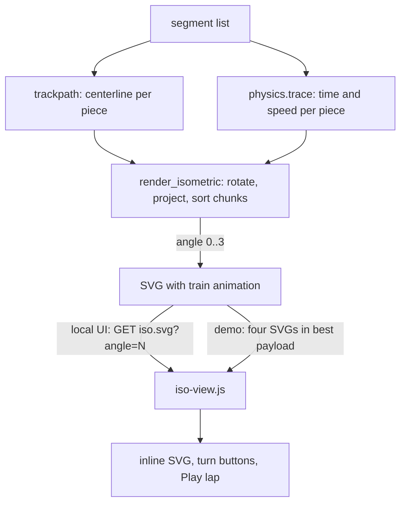

# Isometric Ride View - Plan

## Goal Capsule

- **Objective:** Someone watching a ride evolve can tell by looking what the ride is, where the hills, drops, and turns are and how a train would run it, without loading the game.
- **Means:** An isometric picture of the best ride so far, with quarter-turn rotation and an animated train, replacing the top-down plan.
- **Product authority:** This Product Contract is authoritative on behavior and scope. Free orbiting, speed colouring, and the game's own artwork are not active scope.
- **Execution profile:** Code change in one repo. The engine stays standard library only and CI runs Python 3.9.
- **Open blockers:** None.

---

## Product Contract

Product Contract preservation: unchanged in meaning and IDs. The four questions it deferred to planning are answered in KTD1, KTD2, KTD5, KTD6, KTD8, and KTD9 and removed from Outstanding Questions.

### Summary

While a run generates, the best ride so far appears as an isometric picture of a coaster: rails, ties, and support columns, drawn back to front like the game's own view. The viewer can turn it a quarter turn at a time. A train runs a compressed lap around the track, slow on the lift and fast on the drops. The picture replaces the top-down plan in the web UI and the browser demo.

### Problem Frame

Today the plan view is a grid of squares shaded by height. It shows where the track goes but not what the ride is. A viewer cannot tell a hill from a turn or a drop at a glance, and height lives on a separate side-profile chart. The only way to see what a ride looks like is to load it into the game, which is a slow loop for a question as simple as "did the hill survive?".

`STRATEGY.md` names rendering and fit as a track of its own: a high-scoring ride is only worth anything if you can tell it fits your park and is worth placing. The same picture is also the first thing a visitor to the browser demo sees of a run, so it carries the impression of the project as well as the check on a ride.

### Key Decisions

- **The picture is a static isometric image with rotate controls, not a freely draggable 3D view.** (session-settled: user-directed; chosen over a drag-to-orbit canvas: a static picture with rotate buttons is enough.) Governs R1, R6.
- **It replaces the top-down plan rather than sitting beside it.** (session-settled: user-directed; chosen over keeping both: one picture of the ride is enough.) Governs R13.
- **A train animates on the track.** (session-settled: user-directed; chosen over a static picture alone: the train shows how the ride runs, not only its shape.) Governs R8, R9, R10, R11, R12.
- **The lap is compressed to about 20 seconds and keeps the simulation's speed ratios.** (session-settled: user-directed; chosen over real time, about 66 seconds for the Manic Miner reference ride, and over constant speed, which hides the speed information the physics already has.) Governs R9.
- **The size label, ground grid, and station marker carry over from the top-down plan.** (session-settled: user-approved; proposed because checking that a ride fits the park is part of why a ride is drawn at all.) Governs R4.
- **Replacement covers every place the app and demo show the plan today. The old plan drawing and the command-line plan file stay.** (session-settled: user-approved; proposed over removing them: scripts and devlog images still use them.) Governs R13.
- **The chosen angle stays put when a new best ride arrives, and the train restarts.** (session-settled: user-approved; proposed over resetting the angle on every new best, which would undo the viewer's choice every few seconds.) Governs R7, R11.
- **A ride that stalls shows the train stopping where it stalls, with a marker.** (session-settled: user-approved; proposed to match how the side profile already marks a stall.) Governs R10.
- **With reduced motion, the train sits still, a line says why, and a Play lap button runs one lap on demand.** (session-settled: user-directed; chosen over a still train with an explanatory line only.) Governs R12.
- **The picture shows generide's model of the ride, not the game's exact geometry.** Lap proportions inherit the ride length error tracked in joshgarlitos/generide#60 and shift when that is fixed. (session-settled: user-approved; proposed over waiting on #60 before starting.)
- **The look is not fixed in advance.** The first piece of work is a rough render of the Manic Miner reference ride that the user judges by eye. (session-settled: user-approved; proposed because style is cheaper to judge than to specify.)

### Requirements

**The picture**

- R1. The best ride so far is drawn as an isometric picture of a coaster: two rails, ties along the track, and support columns from the track down to the ground.
- R2. Pieces nearer the viewer are drawn in front, so where a track passes over itself, the upper piece is on top.
- R3. Turns are smooth curves, and each slope rises in proportion to its piece definition, so a steep slope visibly rises four times as much as a gentle one over the same distance.
- R4. The picture shows a ground grid, the ride's size in tiles, and a marker at the station.
- R5. The picture paints its own dark background and uses the design system's chart colours, like the other pictures.

**Turning the view**

- R6. Controls turn the view in quarter turns, giving four angles around the ride, and turning redraws the picture from the new angle.
- R7. The chosen angle stays when a new best ride arrives and when the run finishes.

**The train**

- R8. A train runs laps around the track, each starting at the station and repeating without end.
- R9. A lap takes about 20 seconds whatever the ride's length, and the train's speed along it follows the simulation's speed on each piece.
- R10. When the simulated train stalls, it runs to the stall point and stops there, and a marker shows where.
- R11. Each new best ride, and each turn of the view, restarts the lap from the station.
- R12. When the viewer's device asks for reduced motion, the train sits still at the station, a line beside the picture says that is why, and a Play lap button runs one lap on demand.

**Where it appears**

- R13. The picture replaces the top-down plan on the run screen, live and finished, on the run compare screen, and on the browser demo page.
- R14. The browser demo draws the same picture from the same engine, with no server.

### Key Flows

- F1. Watching a run generate
  - **Trigger:** The viewer starts a run, or opens one that is running.
  - **Steps:** Before the first ride, the screen keeps its current "first ride appears after the first generation" message. The first best ride appears with the train lapping. Each improvement replaces the picture, keeps the angle, and restarts the lap at the station. When the run ends, the final ride stays on screen.
  - **Outcome:** The viewer sees the ride take shape and how its train runs it.
  - **Covered by:** R1, R7, R8, R9, R11

- F2. Turning the view
  - **Trigger:** The viewer presses a turn control.
  - **Steps:** The picture is redrawn from the next quarter turn and the train starts a new lap at the station.
  - **Outcome:** A piece hidden behind a hill from one angle can be seen from another.
  - **Covered by:** R2, R6, R11

- F3. Viewing with reduced motion
  - **Trigger:** A ride appears on a device set to reduce motion.
  - **Steps:** The train sits at the station, a line explains why, and Play lap runs one lap when pressed and returns the train to the station.
  - **Outcome:** The viewer is not moved against their settings and can still watch a lap.
  - **Covered by:** R12

### Acceptance Examples

- AE1. **Covers R3.** Given a one-tile gentle slope piece and a one-tile steep slope piece, when drawn, the steep one rises four times as much as the gentle one.
- AE2. **Covers R2.** Given a track that passes over itself, when drawn from each of the four angles, the upper piece is in front of the lower one at the crossing.
- AE3. **Covers R7, R11.** Given a run in progress with the view turned a quarter turn, when a better ride arrives, it is drawn from the same quarter turn and the train starts at the station.
- AE4. **Covers R10.** Given a ride whose train runs out of speed on a hill, when its picture shows, the train stops at that hill with a marker and does not complete the lap.
- AE5. **Covers R12.** Given reduced motion is on, when the picture appears, the train is still at the station and a line explains why. When Play lap is pressed, the train runs one lap and returns to the station.
- AE6. **Covers R9.** Given the Manic Miner reference ride, whose simulated lap is about 66 seconds with 39 percent of it on the lift and station, when it plays, the lap takes about 20 seconds and the train spends the same 39 percent of the lap there.

### Success Criteria

- Looking at the Manic Miner reference ride, the user can say which parts are hills, drops, and turns without the side profile, and judges the picture good enough to ship after the first rough render.
- Drawing the picture adds no noticeable time to a run, including in the browser demo, where an engine run takes tens of seconds.

### Scope Boundaries

**Deferred for later**

- Dragging to spin the view freely.
- Colouring the track by speed, or marking the lift hill with its own colour.
- Using the game's own artwork.

**Not changing**

- The top-down plan drawing and the command-line plan file stay as they are.
- The side profile and the score chart are unchanged.
- Physics numbers and ride length calibration are separate work (joshgarlitos/generide#60).

### Dependencies / Assumptions

- The train's per-piece speed and time come from the same physics walk that feeds the ride stats, so the lap's proportions shift when #60 is fixed. The picture must not hard-code lap numbers.
- Slope steepness comes from the piece definitions: the gentle slope rises 2 height units over one tile and the steep slope 8. If a height unit is a quarter of a tile, these come out near 27 and 63 degrees, close to the pieces' 25 and 60 degree names. This is unverified and the first rough render confirms it against the Manic Miner reference ride.
- The engine stays standard library only, runs in the browser through Pyodide, and passes CI on Python 3.9, as the browser demo plan requires.
- The viewer's reduced-motion setting is readable by the page.

### Sources / Research

- `rct2/render.py`: the top-down plan (`render_track`, `plan_track`), the side profile, and the shared palette and dark background.
- `rct2/geometry.py` and `rct2/segments.py`: piece poses, headings, and elevation per piece, which give the track's path and slopes.
- `rct2/physics.py`: `trace()` returns per-piece time, speed, lift flags, and the stall point. For the Manic Miner fixture it gives 89 pieces, a 65.7 second lap, 25.8 seconds on lift and station, speeds from 1.6 to 16.7 m/s, and a footprint of 15 by 18 tiles and 22 height units.
- `rct2/webui.py`, `rct2/webui_static/app.js`, `rct2/demo.py`, and `demo/app.js`: where the plan is served and shown today, including the compare screen. The picture is swapped only when the best ride changes.
- `STRATEGY.md`, "Rendering and fit": why seeing and judging fit matters.
- `docs/plans/2026-10-03-1617-feat-try-in-browser-plan.md`: the browser demo this picture must also work in.

---

## Planning Contract

### Key Technical Decisions

- KTD1. **The picture is inline SVG in the page, not an image.** The page needs to pause, restart, and replay the train, and a picture loaded through an image tag cannot be told to stop. An inline SVG with SMIL animation can: `pauseAnimations()`, `setCurrentTime(0)` and `unpauseAnimations()` give still, restart, and Play lap without a server round trip. Governs R8, R11, R12.
- KTD2. **The engine draws, the page turns.** `render.render_isometric(segments, angle, ...)` is a pure function returning one SVG for one quarter-turn angle. The local web UI fetches `GET /api/runs/{id}/iso.svg?angle=N` when the viewer turns. The browser demo gets all four angles in each `best` payload, because the engine runs in a worker that cannot answer a request mid-run. Governs R6, R7, R13, R14.
- KTD3. **Track geometry lives in its own module.** `rct2/trackpath.py` turns a segment list into one centerline per piece (world tile coordinates plus height), built from `geometry.py` poses and `segments.py` definitions. The renderer and the train both read it, so the train rides exactly the line the rails are drawn on. Governs R1, R3, R9.
- KTD4. **Pieces are drawn as short chunks sorted back to front, with a height tiebreak.** Each piece's centerline is cut into chunks, and every chunk (rails, ties, its support column) is one paint-order item keyed by rotated depth, then height. A crossing then paints the upper chunk last from all four angles. Whole-piece sorting would draw a long piece wholly in front of or behind a piece it only partly overlaps. Governs R2.
- KTD5. **Turns are circular arcs derived from the piece's own entry and exit.** A quarter turn's radius is its forward offset and a half turn's is half its sideways offset, so the 3-tile, 5-tile, and helix pieces share one rule, and the helix's backward-moving end needs no special case. Slopes rise by the piece's own `elevation_delta` with a smooth profile whose start and end slopes follow its slope state. A height unit is a quarter tile, which gives about 27 and 63 degrees for the 25 and 60 degree pieces (AE1; confirmed in U2). Governs R3.
- KTD6. **The train moves by SMIL `animateMotion` along the same path, with per-piece timing.** `keyPoints` are cumulative path length in screen space and `keyTimes` are cumulative simulated time from `physics.trace()`, so the train is slow on the lift and fast on drops and the lap is 20 seconds whatever the ride's length. A stalled ride's path stops at the start of the stalled piece, the animation freezes there, and a cross marks it. Lap numbers are never hard-coded, so they follow `trace()` when joshgarlitos/generide#60 changes ride length. Governs R9, R10.
- KTD7. **One shared module draws the view in both pages.** `rct2/webui_static/iso-view.js` builds the picture, turn controls, reduced-motion handling, and Play lap. The local web UI imports it, and `tools/build_demo.py` copies it into the site beside `tokens.css` and `style.css`. The two apps stay separate; only this component is shared. Governs R6, R7, R12, R13, R14.
- KTD8. **Turn controls are two buttons, "Turn left" and "Turn right", with a "View N of 4" label.** Four angle buttons add a control group for no extra capability, because a quarter turn at a time is the requirement. The default angle is set by eye in U2. Governs R6.
- KTD9. **Reduced motion is read by the page once per picture** through `matchMedia("(prefers-reduced-motion: reduce)")`, which pauses at time zero and shows the Play lap button. Governs R12.

### High-Level Technical Design

Paint order for one picture: ground grid, then all chunks sorted by rotated depth then height (each chunk draws its support column, then its rails and ties), then the station marker, then the train and stall marker on top.

### Scope notes from planning

Considered and not built: rail banking tilt (pieces draw level; nobody asked for it, and the rails read the same shape), a lift hill colour or speed colouring (already deferred in the Product Contract), and a free-orbit view. Revisit banking if the rough render in U2 reads wrongly on banked turns.

---

## Implementation Units

### U1. Track centerline module

- **Goal:** One centerline per piece, in world tile coordinates with height, that the renderer and the train share.
- **Requirements:** R1, R3, R9. Covers AE1.
- **Dependencies:** none.
- **Files:** `rct2/trackpath.py` (create), `tests/test_trackpath.py` (create).
- **Approach:**
  - Start each piece at the entry edge midpoint of its tile and end it at the next piece's entry edge midpoint, using `geometry.advance_position` and the segment's `forward_delta`, `right_delta`, `direction_delta` (KTD3).
  - Straight pieces are lines. Turning pieces are circular arcs by KTD5. The path returns heading-aware sample points, not only endpoints.
  - Height rises by the piece's `elevation_delta` with a smooth profile by KTD5. The exact easing is chosen by eye in U2.
  - Expose per-piece sample lists and the piece boundaries as indexes, so U3 can compute cumulative lengths from the same points.
- **Patterns to follow:** `rct2/geometry.py` for pose math and `_AXES`; `rct2/physics.py` `trace()` for per-piece iteration.
- **Test scenarios:**
  - Covers AE1. A gentle slope piece (0x04) and a steep slope piece (0x05), one tile each, rise 2 and 8 height units, and the steep one rises exactly four times as much.
  - For the Manic Miner fixture (`data/sample_rides/manic_miner_test.td6`, 89 pieces), the path is continuous: each piece's last sample equals the next piece's first sample.
  - For the same closed circuit, the final sample equals the first, in position and height.
  - A quarter turn 3 (0x2A) and quarter turn 5 (0x10) leave on the heading `advance_position` reports and have constant distance from their arc centre.
  - A half-turn helix (0x5A) ends one tile behind where it started in the forward direction, without a jump or reversal in the sample sequence.
  - An empty segment list returns an empty path without raising.
- **Verification:** `tests/test_trackpath.py` passes, and no other module's tests change.

### U2. Isometric renderer and first rough render

- **Goal:** A static isometric picture of a ride from any of four angles, and the rough render of Manic Miner for the user to judge by eye.
- **Requirements:** R1, R2, R3, R4, R5, R6 (angles). Covers AE2.
- **Dependencies:** U1.
- **Files:** `rct2/render.py` (modify), `tests/test_render.py` (modify), `docs/assets/manic-miner-isometric.svg` (create, for the devlog).
- **Approach:**
  - `render_isometric(segments, angle=0, lift_indices=None, title=...)` returns SVG in the existing style: literal colours from `GRAPH`, its own dark background, `role="img"` with `<title>` and `<desc>`, and the size label and station marker carried over from `render_track` (R4).
  - Rotate world coordinates by `angle` quarter turns about the footprint centre, then project 2:1 with a fixed height scale. The scale constant is a single named value, tuned by eye.
  - Ground grid at the track's lowest height. Support columns every few chunks from the rail down to the ground (KTD4). Two rails and ties along each chunk.
  - Merge chunk geometry per paint item, and keep each picture small: aim for a Manic Miner SVG well under 150 KB, since the demo carries four per payload.
  - Share the empty-track card (`_empty_svg`) for an empty ride.
- **Execution note:** Render the Manic Miner fixture to SVG and a PNG (headless Chromium through Playwright) and send both to the user. **Stop and get the user's judgement on the look, the default angle, and the height scale before building U3 onward.** Record the verdict and the default angle in this plan's KTD8.
- **Patterns to follow:** `render_track` and `render_profile` for layout, palette, text, and `_escape`.
- **Test scenarios:**
  - Covers AE2. A hand-built track that passes over itself, drawn at angles 0 to 3, paints the upper chunk after the lower one at the crossing in all four.
  - The SVG parses, paints its own background, and uses only literal colours (the existing background and literal-colour tests are extended to it).
  - The footprint label matches `track_bounds`, as `test_the_plan_matches_the_geometry_it_came_from` does for the plan.
  - Four angles of one ride give four different pictures, and angle 4 equals angle 0.
  - The Manic Miner SVG is under the size budget.
  - An empty segment list renders the empty card.
- **Verification:** The render is on screen and the user has judged it. `tests/test_render.py` passes.

### U3. The train

- **Goal:** A train that laps the track at the simulation's speeds, stalls where the simulation stalls, and can be held still.
- **Requirements:** R8, R9, R10, R11, R12 (engine side). Covers AE4, AE6.
- **Dependencies:** U2 and the user's go-ahead on the look.
- **Files:** `rct2/render.py` (modify), `tests/test_render.py` (modify).
- **Approach:**
  - Add a train element (a short row of cars, sized by eye) animated with `animateMotion` along the track path (KTD6). `keyPoints` come from the cumulative screen-space polyline length at piece boundaries and `keyTimes` from cumulative `time_s` over the total, so lap proportions are the simulation's and no number is hard-coded.
  - Lap duration is 20 seconds for a completed ride and repeats without end. Pieces on the lift and in the station use `trace()`'s times like any other piece.
  - A stalled ride truncates the path at the start of the stalled piece, plays once and freezes there, and draws the cross and "stalls here" label in `GRAPH["stall"]` as the profile does.
  - The picture ships the animation ready to run; the page pauses it (KTD1).
- **Patterns to follow:** `render_profile`'s stall marker and its use of `trace()` for lift runs.
- **Test scenarios:**
  - Covers AE6. For Manic Miner, the share of `keyTimes` span that sits on lift and station pieces is within one point of that share in `trace()` (about 39 percent), and the animation duration is 20 seconds.
  - Covers AE4. A ride whose train stalls on a hill gets a path that ends at that piece, a freeze at the end, and a stall marker at the same point; its animation does not repeat.
  - `keyPoints` and `keyTimes` start at 0, end at 1, never decrease, and have equal length.
  - A different angle changes `keyPoints` but not the duration or the `keyTimes`.
  - A ride that completes has no stall marker.
- **Verification:** `tests/test_render.py` passes, and a headless render at two times in the lap shows the train in two different places on the track.

### U4. Local web UI

- **Goal:** The isometric view replaces the plan on the run screen (live and finished) and the compare screen, with turn controls and the train.
- **Requirements:** R6, R7, R11, R12, R13. Covers AE3, AE5.
- **Dependencies:** U3.
- **Files:** `rct2/webui.py` (modify), `rct2/webui_static/iso-view.js` (create), `rct2/webui_static/app.js` (modify), `rct2/webui_static/style.css` (modify), `tests/test_webui.py` (modify).
- **Approach:**
  - `GET /api/runs/{id}/iso.svg?angle=N`: render the run's latest best ride at that angle (KTD2). A missing or non-numeric angle means 0, and any integer is taken modulo 4.
  - `iso-view.js` fetches the SVG, inlines it, adds Turn left and Turn right buttons with a "View N of 4" label, and keeps the chosen angle in page state so a new best ride redraws at the same angle and restarts the lap (R7, R11). It pauses at time zero and shows Play lap when reduced motion is on (KTD9), with a line saying why. Play lap runs one lap and returns to the station.
  - In `app.js`, replace the plan picture in `renderPictures` and in the compare grid. Image alt text and captions change from "Top-down plan" to the isometric wording. Keep `plan.svg` and `profile.svg` routes as they are.
  - Inlined SVG ids are made unique per picture so the compare grid can hold several.
- **Patterns to follow:** `picture()` and `renderPictures` in `rct2/webui_static/app.js`; `WebUI.svg` in `rct2/webui.py`.
- **Test scenarios:**
  - `iso.svg` returns `image/svg+xml` starting with `<svg` for a run with a best ride, as the existing endpoint test does for the other kinds.
  - `iso.svg?angle=1` differs from `angle=0`, and `angle=5` equals `angle=1`.
  - A run with no improvements returns the empty card rather than an error.
  - Covers AE3. In a browser pass against a running local UI, a view turned a quarter turn stays at that angle when a better ride arrives and the train starts at the station.
  - Covers AE5. With reduced motion emulated, the train is still at the station, the explaining line shows, and Play lap runs one lap and returns it.
- **Verification:** `pytest` passes, and a headless-Chromium pass over the run screen and the compare screen confirms the picture, turn buttons, and train, with screenshots checked by eye (`ce-test-browser`).

### U5. Browser demo

- **Goal:** The same picture on the demo page, drawn by the same engine with no server.
- **Requirements:** R13, R14, R6, R7, R11, R12.
- **Dependencies:** U4.
- **Files:** `rct2/demo.py` (modify), `demo/app.js` (modify), `tools/build_demo.py` (modify), `tests/test_demo.py` (modify), `tests/test_build_demo.py` (modify), `demo/tests/demo.spec.mjs` (modify).
- **Approach:**
  - `ride_result` replaces `plan_svg` with `iso_svgs`, four strings indexed by angle (KTD2). The rest of the payload is unchanged.
  - `build_demo.py` copies `iso-view.js` into the site beside the shared CSS (KTD7), and `app.js` in `demo/` imports it. The `plan_svg` key and its test assertion are updated together.
  - The picture's turn state lives in the page, so a new `best` message redraws at the current angle.
- **Patterns to follow:** `picture()` and `slotUrl` in `demo/app.js`; the shared CSS copy in `tools/build_demo.py`.
- **Test scenarios:**
  - `ride_result` returns four distinct, parseable `iso_svgs` and no `plan_svg`.
  - `build_demo` output contains `iso-view.js`, and `engine_files` still packs every module including `trackpath.py`.
  - In the browser test, a default run ends with an isometric picture, turn buttons change the picture, and the existing "Top-down plan of the ride" assertions are updated to the new alt text.
  - The timed smoke cases stay within their limits, which is the success criterion that drawing adds no noticeable time.
- **Verification:** `pytest` passes, `python tools/build_demo.py` builds, and `npx playwright test` from `demo/` passes including both timed smoke cases.

### U6. Docs and captured learning

- **Goal:** The docs say what the picture is, the devlog records how it came out, and what the work taught is written where the next session finds it.
- **Requirements:** Success criteria.
- **Dependencies:** U5.
- **Files:** `README.md`, `docs/devlog.md`, `docs/roadmap.md`, `docs/architecture.md`, `docs/solutions/` (a note per non-obvious finding).
- **Approach:**
  - Update the README line that says the track renders as a top-down plan, and the architecture page's list of renderers.
  - Add a devlog entry in its existing format, with the final Manic Miner picture and what was measured versus assumed (the 27 and 63 degree check, the lap share, the picture size).
  - Tick the item in the roadmap. Capture anything surprising with `ce-compound`, for example how SMIL timing interacts with projected path length or what the helix pieces needed.
- **Test expectation:** none -- documentation only.
- **Verification:** The README and devlog follow `docs/writing-style.md`, with no em dashes.

---

## Verification Contract

| Check | Command | Applies to |
|---|---|---|
| Engine and web UI tests | `pytest` (Python 3.9 in CI, so no syntax newer than 3.9) | U1 to U5 |
| Demo build | `python tools/build_demo.py` after `npm ci --prefix demo` | U5 |
| Browser tests and timed smoke runs | `npx playwright test` from `demo/` | U5 |
| Look of the picture | Render Manic Miner to PNG in headless Chromium and view it | U2, U3, U4 |
| Local UI in a browser | Run the web UI, open a run and the compare screen, turn the view, emulate reduced motion | U4 |

The engine stays standard library only. Pictures use literal colours from `GRAPH` so they look the same in any theme.

## Definition of Done

- Every R in the Product Contract is met, and AE1 to AE6 each have a test or a recorded browser check.
- The user has judged the first rough render and the default angle and scale are recorded in KTD8.
- `pytest`, the demo build, and `npx playwright test` pass, including the timed smoke cases.
- The old top-down drawing, the plan file output, the side profile, and the score chart are unchanged.
- README, devlog, and roadmap are updated, and the learning is captured or one line says nothing was.
- No abandoned experiment code is left in the diff.
