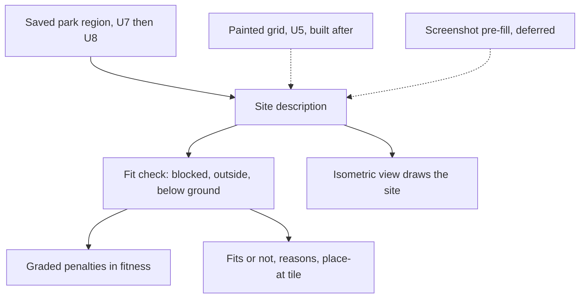

# Site-Aware Ride Fit - Plan

## Goal Capsule

- **Objective:** A player can mark a space in their park and get a mine train ride designed to fit it, instead of hand-fitting a ride that was built for empty flat ground.
- **Means:** A site description (usable tiles, blocked tiles, ground height) that the existing genetic algorithm treats as its footprint (KTD1).
- **Authority:** Product Contract requirements win on behavior, Key Technical Decisions win on mechanism, units override neither.
- **Stop conditions:** Stop and report if no-site runs stop matching today's results for the same seed (R2). Also stop and ask the owner if the park-read spike (U7) shows the game cannot expose map data: that is an expected possible answer, and the painter (U5) then becomes the lead input.
- **Execution profile:** `ce-work`, one PR per phase (Phased Delivery). U7 needs the owner's machine, the game and a saved park, so the owner runs it. No change reaches the game; rides still reach it as an installed file.

---

## Product Contract

### Summary

generide's request grows from a rectangle and a minimum height into a site description: which tiles are free, which are blocked, and how high the ground is. The generator scores a ride's fit against it with the same graded penalties it already uses for footprint. The lead way to fill it in is a region of the player's real saved park, once a short spike confirms the game can supply the land and objects. Painting a grid, which works with no game installed, follows, and a screenshot that pre-fills the grid comes after that.

### Problem Frame

Today the request gives the generator a bounding box and a single minimum height, and the rules know nothing about uneven ground, trees, paths, water or other rides. A generated ride therefore has to be fitted by hand into a real park, or it does not fit. The people who benefit are players who build in an existing park, and someone exploring the tool without the game, who can still describe a space and watch a ride grow into it. The strategy file lists the first user only, so the second is new (see Documentation Plan).

### Requirements

**Site description**

- R1. A request can carry an optional site description: for each tile whether it is usable or blocked, and its ground height. A site also names an anchor tile for the ride's first station piece. The heading is not part of the request: the tool tries all four and reports the best.
- R2. With no site, a run produces the same result for the same seed as it does today.
- R3. A site is saved with the run's request and can be reloaded or rerun, the same way other request settings are.

**Fit**

- R4. The generator scores a ride against the site with graded penalties for each track, station, entrance or exit tile that is blocked or outside the site, and for track that runs below local ground. Evolution can steer toward a fit.
- R5. A finished ride reports whether it fits its site and, if not, the first reasons (which kind of violation, how many tiles).
- R6. The result tells the player where to place the ride in the game: the tile for its first station piece and the heading the ride fit at, meaning which way to rotate the design.

**Inputs and display**

- R11. When the spike says it is possible, the user can choose a saved park, a rectangle of tiles in it and an anchor, and the region becomes the site: tiles the game reports as unbuildable (scenery, rides, paths, water, land the player does not own) are blocked, and ground height comes from the map.
- R7. In the local web UI and the browser demo, the user can paint a site (usable, blocked, optional height) on a grid and start a run against it. Built after the real-game path (Phased Delivery).
- R8. The isometric ride view draws the site under the ride: blocked tiles and ground height.

**Comparison and feasibility**

- R9. A benchmark reports fit rate on a few canned sites, so different ways of supplying or searching a site can be compared on one measure.
- R10. A short, written spike answers whether a real saved park's land height, ownership, scenery, paths and rides can be read through the headless game route, and what unit and coordinate conventions it reports.

### Key Decisions

- Lead with the real game: the shared core and the park-read spike first, then import a region of a saved park, with the painter and then the screenshot door after. **Governs R1, R7, R10, R11.** (session-settled: user-directed - chosen over painter first: real value from the owner's own park should come before a hand-drawn grid.)
- The generator stays the genetic algorithm; generative, reinforcement learning and world-model generators are set aside. **Governs R4.** (session-settled: user-directed - chosen over a new generation method: any such generator would also need a site description, and the strategy file asks to hold new generation methods until calibration is solid.)

### Success Criteria

- A run against a canned irregular site returns a ride that reports it fits, on a measured share of seeds. The target share is set after the first measurement in U6, not guessed now.
- The player can tell from the result alone whether a ride fits and where to place it.
- The no-site path is unchanged: same seed, same result, same run time within noise.
- When the spike says yes, a region of a real saved park becomes a site and a run against it reports whether the ride fits.
- Once the painter lands, a person with no game installed can paint a space and see a ride grow into it in the browser demo.

### Scope Boundaries

**Deferred for later**

- A screenshot that pre-fills the painted grid, for the user to correct.
- Placing the ride live in the player's open game, and dragging the region to see it re-fit.
- Searching anchors automatically so the generator finds the best spot in a larger site.
- Clicking a region on a map view of the imported park. The first import takes the region as tile coordinates.
- Using the map to compute the park-dependent rating bonuses (proximity, scenery, sheltered).
- Generative, reinforcement learning and world-model generators.

**Considered and not built**

- Making blocked tiles a hard rule inside mutation. A hard rule gives evolution nothing to climb on a tight site, and footprint and underground are already soft penalties (KTD2).
- Guest path routing and queue layout around the site. Entrance and exit tiles are checked; the walking route is not.

### Dependencies and Assumptions

- Assumption: a station needs flat ground and a path connection. Unchecked, and it may be the hardest part of fitting on uneven ground (Open Questions).
- Assumption: the game's plugin can read the map from a saved park launched headless. Unchecked, which is why U7 exists. U7 and the import run on the owner's machine, which has the game and a saved park; the cloud session has neither.
- Assumption: a site is small enough to paint by hand in a browser, at most the existing footprint maximums of 60 by 60 tiles in the demo (`rct2/demo.py`).

### Acceptance Examples

- AE1. **Covers R4, R5.** Given an L-shaped site, when a run finishes, the best ride has no track tile outside the L and reports that it fits.
- AE2. **Covers R4.** Given a free rectangle with a blocked 2 by 2 block in the middle, the ride loops around the block instead of crossing it.
- AE3. **Covers R2.** Given the same seed and no site, the best ride and its score are identical to a run on the commit before this plan.
- AE4. **Covers R5, R6.** Given a site where no fitting ride was found, the result says it does not fit, names the violation counts, and offers no "place at" instruction as if it fitted.
- AE5. **Covers R11.** Given a saved park with a tree on one tile of the chosen region, the imported site marks that tile blocked and uses the map's ground height for the rest.

---

## Planning Contract

### Key Technical Decisions

- KTD1. **A site is one saved structure and one pure check.** Tile states and heights and an anchor, in a single module beside geometry. Fitness, the result summary and the benchmark all call the same check, so there is one answer to "does it fit", as `rct2/construction.py` is the one answer to "can it be built".
- KTD2. **Site violations are graded penalties, not hard rules.** Footprint excess and underground are already soft penalties in `rct2/fitness.py`, and a hard rule would leave evolution with nothing to climb on a tight site. Each per-kind penalty is capped so a hard site cannot ratchet genome length, the failure in `docs/solutions/performance-issues/genome-bloat-from-uncapped-fitness-rewards.md`. Each cap also stays above the largest reward a ride can earn, so a fitting ride always outscores a violating one of equal quality.
- KTD3. **No site means the old code path, not an all-free site.** When a request has no site, today's width, depth and minimum-height logic runs untouched in both fitness classes, so R2 holds by construction and AE3 is a regression test, not a hope. With a site, construction validation is called without width, depth or a minimum elevation, so the old rectangle can neither wipe out a ride the site allows nor rotate the footprint.
- KTD4. **The user picks the anchor, the tool tries all four headings, and site heights are absolute.** The generator evolves a ride relative to its own start, as it does now. The site check maps those tiles onto the site through the anchor and each of the four headings, takes the best, and places the ride's start at the anchor tile's ground height, so a tile is below ground when anchor height plus track height is under that tile's ground height. Searching anchors is deferred. (session-settled: user-directed - chosen over the user picking the heading: fewer false does-not-fit results, and the heading is a result to report rather than a guess to supply.)
- KTD5. **The painter is shared JavaScript, like the isometric view.** One file loaded by both pages and copied into the demo by `tools/build_demo.py` (`SHARED_JS`), following `rct2/webui_static/iso-view.js`.
- KTD6. **The spike reuses the oracle's headless launch with a throwaway plugin.** Same approach as `tools/oracle_probe.js`; its finding is a document, and no production code depends on it until the finding says yes.
- KTD7. **Park import goes through the same game launch and the same lock as the oracle.** The plugin folder is the game's one real folder, so an import, a check and an install must not overlap; the import takes the lock `rct2/openrct2_paths.py` already uses for checks. (session-settled: user-directed, see the build-order Key Decision.)

### High-Level Technical Design

Three ways to fill the site feed one description, which the generator and the display both read. The saved park comes first, once U7 says yes; the painter is built after it, and the screenshot is deferred.

### Research Notes

- The request is `CoasterRequest` in `rct2/fitness.py` (width, depth, optional rating ranges); `PhysicsFitness` applies footprint excess and underground as per-tile and per-unit penalties.
- `rct2/geometry.py` already produces every occupied tile with its height (`occupied_tiles`), so the check needs no new tracing. `validate_track` allows the footprint to rotate, which a site check must not (KTD4).
- `rct2/generate.py` computes entrance and exit positions and the space they need (`calculate_space_required`), which the check reuses so those tiles count (R4).
- The web form is generated from a declarative table in `rct2/settings.py` that becomes command-line flags for `evolve_coaster.py`, so a site travels as a file path flag. The demo has its own validation and maximums in `rct2/demo.py`.
- The isometric renderer already draws a ground grid and takes a start position (`render_isometric` in `rct2/render.py`).
- Install copies a `.td6` into the game's track folder (`rct2/openrct2_paths.py`); the player places it. Hence R6 is a message, not an action.
- The oracle's spike found a `.park` file can be loaded headless and plugins run, but it only read ride ratings (`docs/headless-oracle-spike.md`); map access is untested.
- The demo's runs are time-boxed: the largest preset must stay under 30 seconds (`docs/devlog.md`, 2026-10-03), so the fit check must be cheap per evaluation.

---

## Implementation Units

### U1. Site description and fit check

- **Goal:** One module that holds a site and answers whether a list of occupied tiles fits it.
- **Requirements:** R1, R4, R5, R6.
- **Dependencies:** none.
- **Files:** `rct2/site.py` (new), `tests/test_site.py` (new).
- **Approach:**
  - Represent tile state (usable, blocked) and ground height per tile and an anchor, with a stable saved form (KTD1).
  - The check maps track-relative tiles into site coordinates through the anchor and a heading (KTD4), then reports violation counts by kind: outside the site, on a blocked tile, below local ground. A second function tries all four headings and returns the one with the fewest violations, taking the first of north, east, south, west on a tie. That is four cheap checks per evaluation.
  - Include the station's entrance and exit tiles on the side the export puts them. `calculate_entrance_positions` in `rct2/generate.py` chooses that side from track geometry alone, and the written file follows it, so the check scores that side and not the better of the two; otherwise a ride could be reported as fitting while its entrance lands on a blocked tile. The side is found once per evaluation, because that helper runs a flood fill. Making the export choose a free side is deferred.
  - Site heights are absolute and in the same units as track height. The ride's start sits at the anchor tile's ground height (KTD4). Converting from the game's map units waits for U7.
- **Patterns to follow:** `rct2/construction.py` for the single-answer shape, `ValidationIssue` in `rct2/geometry.py` for violation records.
- **Test scenarios:**
  - Covers AE1. A ride whose tiles all lie inside an L-shaped site reports no violations.
  - A tile one step outside the L is counted as outside.
  - A tile on a blocked cell is counted as blocked, once per tile.
  - Track at height 2 over ground of height 4 counts as below ground; the same track over ground of height 0 does not.
  - On a sloped site whose anchor tile has ground height 6, a ride at relative height 0 is level with its anchor and reports no below-ground violation on tiles of height 6 or less.
  - A blocked tile on the side the export uses for the entrance counts as a violation; a blocked tile on the other side does not.
  - The entrance and exit the export writes sit on tiles the check approved.
  - A heading of east maps the same track to rotated tiles and gives the expected tile set.
  - A ride that fits only when turned east reports no violations and the heading east from the try-all-four function; a ride that fits at no heading reports the heading with the fewest violations.
  - The station entrance tile off the site counts as a violation.
  - A saved site round-trips to an equal site.
- **Verification:** All of the above pass and the module has no dependency on web or run code.

### U2. Fitness uses the site

- **Goal:** Evolution steers toward a fit, and no-site runs are untouched.
- **Requirements:** R2, R4.
- **Dependencies:** U1.
- **Files:** `rct2/fitness.py`, `evolve_coaster.py`, `tests/test_fitness.py`, `tests/test_evolve_coaster.py`.
- **Execution note:** Write the characterization test for AE3 first, against the current code, before changing fitness.
- **Approach:**
  - `CoasterRequest` gains an optional site. Both fitness classes accept it: `WeightedProxyFitness` (and so `ProxyFitness`, the command line's default) and `PhysicsFitness`. `evolve_coaster.py` passes it to whichever class `--fitness` selects, since the two are built differently there today.
  - With a site, each class applies the graded U1 penalties and calls `validate_construction` without width, depth or minimum elevation (KTD3). Today the proxy adds a flat `invalid_construction_penalty` of 10000 for any construction issue, and `PhysicsFitness` adds `validity_weight` per issue, so leaving the old rectangle in place would turn a spill past it into a cliff.
  - The penalties use the best of the four headings, so a ride that fits at one heading takes no site penalty.
  - Penalties are capped per kind and each cap exceeds the largest reward a ride can earn (KTD2).
- **Patterns to follow:** The existing `bounds_penalty_per_tile` and `underground_penalty_per_unit` fields in `WeightedProxyFitness`.
- **Test scenarios:**
  - Covers AE3. For three fixed seeds with no site, fitness and best ride match values recorded before the change.
  - A ride with more blocked tiles scores lower than the same ride with fewer.
  - Penalties stop growing past the cap, so a ride with 500 violations does not score below a ride with the cap's worth.
  - A fitting ride scores higher than a longer, otherwise better ride that heavily violates the site.
  - A ride that fits only when turned east takes no site penalty, and the reported heading is east.
  - A ride that spills past the old width and depth but stays inside the site takes no construction-invalid penalty in either fitness class.
  - Under a small site, population-average genome length stays near the ideal length across generations (guards the genome-bloat failure).
  - Covers AE2. On a free rectangle with a blocked 2 by 2 centre, a short seeded run returns a ride with zero blocked tiles, under each of the two fitness classes.
  - Started from the command line with the default `--fitness`, a run given a site applies it (not silently ignored).
- **Verification:** The no-site regression passes, the small-site run finishes in roughly the same time as an open-field run of the same size, and AE2 holds under both fitness classes.

### U3. Request, command line, run record and result summary

- **Goal:** A site can be given to a run, is saved with it, and the result says whether the ride fits.
- **Requirements:** R3, R5, R6.
- **Dependencies:** U1, U2.
- **Files:** `rct2/settings.py`, `evolve_coaster.py`, `rct2/runrecord.py`, `rct2/webui.py`, `tests/test_settings.py`, `tests/test_evolve_coaster.py`, `tests/test_runrecord.py`, `tests/test_webui.py`.
- **Approach:**
  - Add a `--site` flag taking a site file, and a matching settings field the form can carry (a file reference, not inline data).
  - The run record stores the site with the request, and a rerun copies it.
  - `ride_summary` and the run's detail payload add fit status, violation counts and the place-at tile and the heading the ride fit at. A ride that does not fit carries no place-at instruction (AE4).
  - The verdict is worded as "fits the painted site" and states what it did not check: station flatness, path connection and clearance above ground. The caveat stays until U7 and the station question are resolved.
- **Patterns to follow:** How `max_width` and `max_depth` travel from settings to the command line and into `ride_summary`.
- **Test scenarios:**
  - A run started with `--site` writes the site into its record and a rerun copies it.
  - Covers AE4. A run with an impossible site (every tile blocked) finishes with "does not fit", violation counts, and no place-at field.
  - A malformed site file is rejected with a message naming the problem, before a run starts.
  - The run detail payload for a fitting ride includes the place-at tile and heading, and the fit text names the checks it skipped.
  - A record from before this change loads and shows no site.
- **Verification:** Existing request, record and web UI tests still pass; the new tests pass.

### U4. The isometric view draws the site

- **Goal:** The ride is shown sitting on its site.
- **Requirements:** R8.
- **Dependencies:** U1, U3.
- **Files:** `rct2/render.py`, `rct2/webui.py`, `rct2/demo.py`, `tests/test_render.py`, `tests/test_webui.py`, `tests/test_demo.py`.
- **Approach:**
  - `render_isometric` accepts an optional site and draws blocked tiles and ground height under the existing ground grid; usable tiles keep today's look.
  - The picture's extent stays the ride's bounds plus a margin of four tiles. Site tiles beyond the margin are not drawn, so a 60 by 60 site does not shrink the ride, and a no-site picture is unchanged. Site tiles sort behind track and supports in painter's order, and ground height raises a tile above the existing ground level.
  - The `iso.svg` route and the demo's `ride_result` pass the run's site through, in all four views.
  - Violating tiles are marked so a ride that does not fit shows where. Blocked tiles use a hatch and violating track an outline, so no state depends on colour alone, and a small legend names them.
- **Patterns to follow:** The station tile and support-column drawing already in `render_isometric`; painter's order by tile then height.
- **Test scenarios:**
  - A blocked tile appears as its own marked element, and a render with no site is byte-identical to today's.
  - A raised tile draws higher than a flat one by the height difference.
  - A track tile on a blocked cell is marked as a violation.
  - All four view angles include the site.
  - A site much larger than the ride draws only the tiles within the margin, and the picture's size stays within a few percent of the same ride with no site.
- **Verification:** Render tests pass, and the demo payload for a no-site ride has the same size as before within a few percent.

### U5. Painter in the local UI and the demo

- **Goal:** A user can paint a site and start a run against it with no game installed. Built after U8 (Phased Delivery).
- **Requirements:** R7, R1.
- **Dependencies:** U3, U4.
- **Files:** `rct2/webui_static/site-paint.js` (new), `rct2/webui_static/app.js`, `rct2/webui_static/index.html`, `rct2/webui_static/style.css`, `rct2/webui.py`, `demo/app.js`, `demo/index.html`, `rct2/demo.py`, `tools/build_demo.py`, `tests/test_demo.py`, `tests/test_build_demo.py`, `demo/tests/demo.spec.mjs`.
- **Approach:**
  - One shared painter with a tool palette: usable, blocked, raise and lower (with the current brush height shown), anchor, and erase. A grid size selector stays within the demo maximums, and undo and clear-all are available. The anchor is drawn on the grid.
  - Start stays disabled until the grid has a usable tile and the anchor sits on one, with an inline message saying which is missing.
  - Keyboard use: the grid is one tab stop with arrow-key movement, Space or Enter applies the active tool, each tile exposes its state as a label, and a live text summary reports the tile count. The pointer path uses pointer events so touch works, with the grid scrollable on narrow screens.
  - The run result panel, in the local UI and the demo, shows the fit verdict with its caveat, violation counts by kind, and the place-at line only for a ride that fits (R5, R6).
  - The local UI saves the painted site as a file the run reads; the demo passes it into the Pyodide run (KTD5). A rerun reopens the painter with the saved site filled in.
  - The demo clamps site size to its existing maximums, and a painted site is part of the demo's request validation.
- **Patterns to follow:** `rct2/webui_static/iso-view.js` (shared global, built once in `tools/build_demo.py`), `aria-disabled` and focus handling from the isometric controls.
- **Test scenarios:**
  - Painting a 3 by 3 block and starting a run sends a site with those nine tiles blocked.
  - Keyboard only: arrow keys move across the grid, Space paints a 3 by 3 block, and the anchor is set, with the live summary updated.
  - Start is disabled on an empty grid and enabled once a usable tile holds the anchor.
  - The result panel for a ride that does not fit shows violation counts and no place-at line, in both the local UI and the demo.
  - Rerunning a saved run opens the painter with its site filled in.
  - An oversize painted site in the demo is refused with a message, not silently cut.
  - Covers AE1. In the demo, an L-shaped site produces a ride whose result says it fits (browser test).
  - The local UI run screen shows the ride on the painted site in the isometric view.
- **Verification:** Python tests and the Playwright suite pass, and the demo's slowest allowed run still finishes under the existing 30 second budget.

### U6. Benchmark scenarios for fit rate

- **Goal:** One measure to compare ways of supplying or searching a site.
- **Requirements:** R9.
- **Dependencies:** U1, U2.
- **Files:** `rct2/benchmark.py`, `run_benchmark.py`, `tests/test_benchmark.py`.
- **Approach:**
  - Add three canned sites (an L, a rectangle with a blocked centre, a sloped site) and report per site the share of seeds whose best ride fits, where fit means the U1 tile checks only (station flatness and paths are not checked).
  - The benchmark builds its fitness directly (`_search_fitness` in `rct2/benchmark.py`), not through the request, so the canned-site runs pass the site into that construction explicitly. The no-site rows keep today's construction.
  - Report the existing no-site numbers beside them, so any change to the open-field results shows up.
- **Patterns to follow:** `run_benchmark` and `summarize` in `rct2/benchmark.py`.
- **Test scenarios:**
  - The report includes one fit-rate row per canned site.
  - A canned-site row differs from the same seeds run without the site, showing the site was applied.
  - A site no ride can fit reports a fit rate of zero.
  - A fixed seed list reproduces the same fit rate on two runs.
- **Verification:** The first real run's numbers are recorded in `docs/devlog.md` and set the target for the Success Criteria.

### U7. Spike: read a saved park

- **Goal:** Learn whether a saved park can supply a site description, and in what units.
- **Requirements:** R10.
- **Dependencies:** none. It can run in parallel with U1 to U6, and it leads: U8 waits on its decision.
- **Files:** `tools/park_probe.js` (new, throwaway plugin), `docs/park-read-spike.md` (new).
- **Execution note:** This is a spike. The deliverable is the finding, not a feature; nothing in `rct2/` imports from it. The probe and the document's layout are written in a cloud session, but the run needs the game and a saved park, so the owner runs it on their machine and the output goes into the document.
- **Approach:**
  - Follow the oracle's launch route from `docs/headless-oracle-spike.md`: load a saved park headless with a plugin that prints what it reads.
  - Record, with yes, no or partial for each: tile surface height, land ownership, paths, scenery, other rides, water; the units and coordinate origin used; map size.
  - Record how the game aligns a placed design to the cursor, and whether the player can rotate a design as it is placed, so R6's instruction wording can be checked.
  - Keep the raw plugin output for a small real region as a fixture for U8's tests.
  - End the document with a decision: build the import (U8), or stay with the painted grid and screenshot door.
- **Patterns to follow:** `tools/oracle_probe.js` and the findings layout of `docs/headless-oracle-spike.md`.
- **Test scenarios:** Test expectation: none -- throwaway probe against the real game. Its output is checked by reading it, and the finding is dated and states the game version it ran on.
- **Verification:** The document answers each item above and names the decision, with the raw plugin output for the yes cases.

### U8. Import a region of a saved park as a site (contingent on U7)

- **Goal:** The player names a saved park, a rectangle in it and an anchor, and gets a site built from the real land and objects.
- **Requirements:** R11, R1, R3.
- **Dependencies:** U1, U3, and a yes from U7. If U7 says no, this unit is dropped and U5 leads.
- **Files:** `rct2/parkimport.py` (new), `tools/park_dump.js` (new plugin, built from the U7 probe), `rct2/settings.py`, `evolve_coaster.py`, `rct2/webui.py`, `tests/test_parkimport.py` (new), `tests/test_settings.py`, `tests/test_webui.py`. The list is refined once U7 reports what the game exposes.
- **Approach:**
  - Launch the game headless on the saved park through the oracle's route with a dump plugin that prints the region's tiles, taking the lock all game launches share (KTD7).
  - Convert the dump to a site: tiles the game reports as unbuildable or unowned are blocked, ground height comes from the map in track units (the conversion U7 defines), and the anchor is stored (KTD1, KTD4).
  - The first version takes the region as tile coordinates in the settings form and on the command line, with the park file path. Clicking a region on a map is deferred.
  - A missing game or park gives a message naming the setting, as `GameUnavailable` does for check and install.
  - The imported site is saved with the run like any other (R3), and U4 draws it.
- **Patterns to follow:** `rct2/oracle.py` for the launch and output parsing, `rct2/openrct2_paths.py` for the lock and unavailable-game handling.
- **Test scenarios:**
  - Covers AE5. A recorded dump (the U7 fixture) with a tree on one tile gives a site where that tile is blocked and the other tiles carry the dump's heights.
  - A region that runs past the map edge is clipped, and the site records its true size.
  - Unowned land is blocked.
  - An import started while a check or install holds the lock waits or refuses with a clear message, and does not run at the same time.
  - A park path that does not exist is rejected with a message before the game launches.
  - A site imported from the fixture, given to a short run, produces a result that reports fit or not fit.
- **Verification:** The fixture-based tests pass. The owner then imports one real region and the result of a run against it is recorded in `docs/devlog.md`.

---

## Verification Contract

| Check | Command | When |
|---|---|---|
| Python tests | `python3 -m pytest -q` | Every unit |
| Browser tests | `npx playwright test` from `demo/` after `python3 tools/build_demo.py` | U4, U5 |
| No-site regression | the AE3 test in `tests/test_fitness.py`, for both fitness classes | U2 and every later unit |
| Demo time budget | the demo's timed smoke tests in `demo/tests/smoke.spec.mjs` | U5 |
| Spike | read `docs/park-read-spike.md` and its raw output | U7 |
| Real-park import | the owner imports one real region and runs against it | U8 |

## Definition of Done

- Every built unit's verification holds, and all five Acceptance Examples are covered by a test (AE5 only if U8 is built).
- A run with no site matches the pre-change result for fixed seeds (AE3).
- When the painter is built, a person with no game can paint a site in the demo and watch a ride grow into it.
- One ride generated against a site is installed and placed in the game by hand, following the result's place-at line, and the outcome (fits or not, any tile offset) is recorded in `docs/devlog.md`. The site is a real imported region when U8 exists, otherwise a canned site.
- `docs/devlog.md`, `docs/roadmap.md`, `docs/architecture.md` and `README.md` describe the site description.
- The spike document names a decision.
- Abandoned experiments and unused probe code are removed from the diff.

---

## Risks and Dependencies

| Risk | Mitigation |
|---|---|
| A hard site makes genomes grow again | Capped penalties, and a small-site test that watches genome length (U2) |
| A poorly placed anchor makes a workable site look unfit | The heading is tried automatically and reported; the result states the anchor used; automatic anchor search is deferred |
| The game cannot rotate a design as it is placed | U7 records how placement and rotation work; if it cannot rotate, the heading becomes an input again |
| The map cannot be read headless | Expected possible answer; the owner is asked and the painted grid becomes the lead input (U7) |
| The spike needs the owner's game and a saved park | The probe and the document are prepared in the cloud session; the owner runs it and the output goes in the document |
| Game map height units differ from track units | U1 stores track units; the conversion is added only after U7 reports the real units |
| The fit check slows the demo past its time budget | The check is a set lookup over tiles `geometry` already produces; measured in U5's timed tests |
| A station on uneven ground cannot be built | Open Questions; the spike records what the game requires |

## Phased Delivery

1. **Core and spike (U1, U2, U3, U6, and U7 alongside):** the site, the fit penalties, the saved request and result, the benchmark, and the park-read spike. The core is mergeable on its own. U6's first fit-rate measurement and the floor the owner sets for it are recorded in `docs/devlog.md` before phase 2 starts; a rate below the floor means a tuning pass (population, generations) first. U7's decision gates phase 2.
2. **Real game (U8, then U4):** import a region of a saved park, then draw it under the ride. If U7 says no, this phase is dropped and the owner decides what leads.
3. **Painter (U5):** drawing a site by hand in the local UI and the demo. Delivers the no-game experience.

## Open Questions

### Deferred to implementation

- How the game treats a station on sloped ground, and whether a flat patch is required (U7 records what it can).
- What tile the game aligns to the cursor when a design is placed, so the place-at wording in R6 is correct (U7, then a check by hand in the game).
- Whether tight sites need a larger population or more generations to reach a fit (U6 will show it).

## Documentation Plan

- Add a dated entry to `docs/devlog.md` for each phase, the spike's finding included.
- Update `docs/roadmap.md` and `docs/architecture.md` for the site description and the new tile-fit module.
- Update `STRATEGY.md` Users to name someone exploring without the game, and mention the browser demo. This is the open question on PR 76 and waits on the owner's decision. It does not gate the Definition of Done.
- Add the terms Site and Fit to `CONCEPTS.md` after PR 76 merges, to avoid a conflicting edit.

## Sources and Research

- `docs/headless-oracle-spike.md`: headless launch route, plugin API surface, only ride ratings were read.
- `docs/solutions/performance-issues/genome-bloat-from-uncapped-fitness-rewards.md`: why the penalties are capped (KTD2).
- `rct2/fitness.py`, `rct2/geometry.py`, `rct2/generate.py`, `rct2/settings.py`, `rct2/render.py`, `rct2/demo.py`, `tools/build_demo.py`: patterns each unit follows.
- `STRATEGY.md`: the boundary on new generation methods and the Users section.
