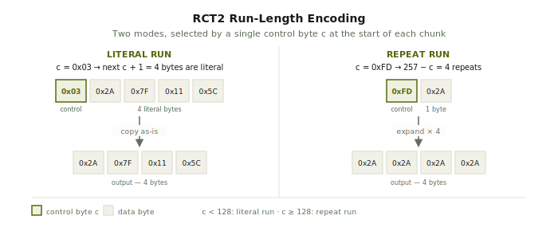

# RLE

RCT2 stores all the information about a roller coaster in a binary file with the extension `.td6`. Before that file is written to disk, RCT2 compresses it using Run-Length Encoding (RLE) to reduce its size.

Encoding is the process of converting data from one format into another for storage or transmission. Run-length encoding is a specific approach: instead of storing every value individually, it represents consecutive repeated values as a single value paired with a count. A sequence of ten identical bytes becomes two bytes. The first is the value; the second is the repeat count. For data with long runs of repeated values, this saves significant space.

To understand how RLE works in practice, you need to know how data is stored in computers.

A bit is the smallest unit of data in a computer. It can only be one of two values: 0 or 1. A byte is a group of 8 bits. Because each bit has two possible values and you have 8 of them, the total number of combinations is 2⁸, which is 256. So a byte can represent any number from 0 to 255.

Bytes are often represented in hexadecimal, a base-16 counting system. Programmers use it because it maps cleanly onto how computers store data: one byte is exactly two hexadecimal digits, since 16² = 256. When you see `0x03`, that's the number 3 in hexadecimal. `0xFD` is 253. For a full explanation of how hexadecimal works, see the [Wikipedia article on hexadecimal](https://en.wikipedia.org/wiki/Hexadecimal).

RCT2's `.td6` file is a sequence of bytes. The RLE layer sits at the bottom of the stack: when reading a file, decompression runs first, before anything else touches the ride data. When writing, compression runs last, after all the ride data has been serialized to bytes.

The format has two modes, controlled by a single byte called `c` at the start of each chunk.

If `c` is below 128, you're in a literal run. The next `c + 1` bytes are raw data, copied straight to output. So if `c` is 3, the next four bytes are literals.

If `c` is 128 or above, you're in a repeat run. The next single byte gets repeated `257 - c` times. So if `c` is 253, that one byte gets repeated four times.

The decoder walks the stream one control byte at a time, picks a mode, emits the bytes, and moves on.

Compression inverts that. It scans forward from the current position, counts identical bytes in a row, and decides: three or more identical bytes get a repeat run; anything else accumulates into a literal chunk until it hits a run or the 128-byte limit.

One thing worth knowing: the same decompressed data can come from multiple valid compressed forms. Three identical bytes could be a repeat run or a three-byte literal chunk. Both decompress identically. So the round-trip test in generide compares decompressed bytes rather than comparing compressed forms to each other — re-compressing a file won't necessarily produce byte-identical output to the original, even when the code is correct.
